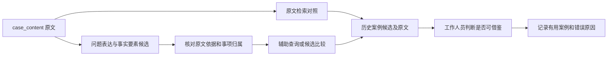

# 扩展综合：从成功实践判断投诉信息该怎样处理

研究日期：2026-10-07 至 2026-10-08；2026-10-08 完成实践补充。当前状态：文献、边界规范、开源能力与实际应用已形成对照，最终字段和模型仍待本项目样例验证。

本次将首轮缺少的实施经验补上：新增 **9 个深读案例、5 篇正式研究文献，以及 2 个开源项目的具体实现**。包括 Uber COTA、Alibaba AliMe、湛江/张家口/海淀政务热线、QJE 客服助手生产研究、Snorkel 合作抽取、JetBrains 与 Airbus 应用。每个案例均说明流程、结果、改进原因和迁移条件；原型与生产结果分别标注。

**对本项目更明确的建议是：保留 `case_content` 原文，围绕历史案例查询研究问题表达、事实要素及其归属，让工作人员能够核对并选择结果。字段是否值得做，要能说明它怎样改善匹配或减少人工判断负担。** 成熟实践给出了这个方向的依据，具体保留哪些字段还需要我们的真实样例。

先读下面的实践判断；完整案例横向比较见 [05 实践案例对照](05-practice-cases.md)。第 2–4 节保留首轮的边界分析、方法候选和现有代码起点。

## 1. 成功实践带来了哪些新依据

### 1.1 四个最有参考价值的经验

| 案例 | 具体怎样做 | 成效证据 | 给本项目的启发 |
| --- | --- | --- | --- |
| **湛江 12345** | 意图与标签、时间/地点/涉事单位、工单摘要、历史相似案例分别提供；自动填单后由坐席审核；接入既有知识库和工单接口 | 市政府上线报道、建设方工程说明和后续事项清单治理记录；有业务数字，未披露受控抽取评测 | 摘要帮助理解，要素帮助核对，分类连接业务，历史案例提供参考；先接成可用流程 |
| **Uber COTA** | 原始工单及可靠业务上下文共同计算候选，给客服展示前三项，人工最终选择；由简单排序逐步迭代深度模型 | 英语工单、数千名客服的生产随机分组实验报告平均处理时长约减少 **10%**；另有离线模型对照 | 原文就是基线；优先评价前列候选是否帮助人；按实际错误决定新增信息 |
| **Alibaba AliMe** | 按任务定义槽位；原文说法映射到规范概念；复杂问题增加属性/条件绑定，并保留检索后备 | 作者报告的 KBQA 三个额外场景（Scenario-1 至 3）会话解决率绝对提高 **7.88/4.90/3.24 个百分点**；未披露随机对照协议，非本项目准确率 | 信息类型、信息角色和适用条件要分清；结构查询有覆盖边界，业务定义需要维护 |
| **QJE 客服助手研究** | 用带处理结果的历史会话训练，优质经验加权；实时提供建议和文档链接，由客服采用、修改或忽略 | 正式论文的非随机分批推广分析（5,172 人总观测样本、其中 AI 观测 1,636 人）报告 **resolved chats/hour** 约提高 **15%**；不是解决率 | 历史记录的质量影响价值；人的经验和问题类型影响收益；应保留修正入口 |

来源：[C04 政务实践](07-civic-practice.md)、[C01/C02 企业实践](06-enterprise-practice.md)、[C07 实证研究](08-applied-evidence.md)。COTA 的 10% 是整个辅助流程相对无推荐界面的结果，不能单独归因于 v2；QJE 的 15% 是工作效率变化，不能写成抽取准确率或问题解决率提升。表内数字是各来源结果，本项目尚未复测。

### 1.2 从这些经验出发，怎样理解我们的两步工作

第一步处理投诉，目标是让当前问题更清楚、关键条件不被弄错；第二步查历史库，目标是给工作人员找到可核对、可借鉴的案例。两步需要联系起来看：例如把居住地错当事发地，字段虽然有值，查询却可能被带偏。

可以把后续候选路线理解为下面的流程。**这是本项目根据调研提出的示意，不是已完成的新系统，也不是某家企业的完整复制。**

这里有五条值得优先采用的实践经验：

1. **按用途设计字段。** 每个候选都说明用于召回、排序、限制条件还是展示。AliMe 的任务槽位和 JetBrains 的问题完整性检查表明，业务动作可以直接决定需要什么信息。[C02、C10]
2. **原文与辅助表示共同保留。** COTA 直接利用工单文本和元数据，湛江分别提供摘要与要素。我们可以比较原文、简短问题表示、原文加辅助信息，先检验何种表示有帮助。[C01、C04]
3. **信息的角色和归属要有表达办法。** AliMe 条件绑定、Snorkel 关系候选、Rasa 的 role/group 都有可核对机制。对多地址、多事项，不应只有互不关联的词表。[C02、C08、O08]
4. **案例库质量与当前规则也影响效果。** QJE 系统利用有结果标签的优质会话；张家口把历史经验与权责库配合。以后若用历史处置辅助判断，应核对其结果、时效和适用条件。[C07、C05]
5. **让人工选择和修订尽早进入流程。** Uber、湛江、JetBrains 都把人与系统放在同一工作流程。先展示少量可解释的案例并记录修改，比只观察 JSON 输出成功率更贴近使用价值。[C01、C04、C10]

这些经验也改变了方法选择的顺序：先确定问题中哪些差异会改变匹配，再判断需要片段抽取、关系判断、概念归一还是组合处理。Snorkel 的研究还提示要收集负例与弃权条件；COTA 的迭代说明吞吐和界面需求同样会影响模型选择。[C08、C01]

### 1.3 字段研究现在可以更具体

候选信息优先围绕三个问题组织：**发生了什么、在哪里及涉及什么对象、希望解决什么问题**；再检查多事项、否定、历史背景和条件是否会改变案例匹配。它们是研究方向，尚未冻结成三字段或五字段的 schema。

例如“住在甲小区，反映乙路工地噪声，希望夜间停工”中，值得研究的不是只把两处地名都提出来，而是能否正确表达噪声问题、乙路的事发角色和夜间停工诉求，并让查询更容易找到相似案例。该句是人工构造例子。Rasa 和 AliMe 提供了角色/条件的实现经验，最终边界仍需原始数据核对。

全部案例、做法、数字口径和改进教训见 [05 实践案例对照](05-practice-cases.md)。来源编号 `Pxx` 为论文、`Gxx` 为规范、`Oxx` 为开源项目、`Cxx` 为实践案例；每一组均可从[来源目录](sources/README.md)追溯。

## 2. 先把边界问题写清楚

以下均为人工构造例子，用于研究和讨论，不是本项目样本或实验结果。

| 边界问题 | 构造例子 | 需要研究或裁决的内容 |
| --- | --- | --- |
| 地点类别与地点角色 | “住在甲小区，投诉乙路工地施工” | 两个都是地点，但分别服务于居住和事发关系；不能只靠地名类型判断 |
| 行为与希望发生的行为 | “希望物业修好电梯” | 原文表达诉求；不能据此判断电梯已经修好 |
| 涉事主体与处理对象 | “向物业反映电梯故障” | 物业在这句话中的作用与电梯不同；是否被投诉还需上下文 |
| 现象与影响 | “施工噪声影响休息” | 噪声现象与影响可有关联；是否需要独立字段及如何计分仍需任务证据 |
| 多问题与同一问题的过程 | “漏水、报修、维修后仍漏水” | 不能按动词或句子数量直接生成多个投诉事项 |
| 事项关联 | “甲楼漏水，乙楼电梯坏了，请先处理后者” | 地址、对象和诉求分别属于哪个事项，需要关系与指代判断 |
| 原文陈述与确定性 | “怀疑店家多收钱，但尚未核对账单” | 不能把怀疑升级为已经证实的事实 |
| 当前诉求与历史背景 | “昨天噪声已停止，今天来电询问办理进展” | 历史问题仍可能有案例匹配价值，但不能当作今日仍在发生；是否参与查询待裁决 |
| 时间表达与时间解析 | “上周开始，每晚十点后施工” | 保留表达与解析成绝对日期是不同任务；缺少时间锚点时如何处理 |
| 缺失、模糊和冲突 | “就在那家店”“前面说甲路，后面更正乙路” | 没有信息、无法确定指代和原文更正需要不同分析，不能一律补全 |
| 原文片段与规范名称 | “半夜干活吵得睡不着”→“夜间施工噪声” | 标准名称涉及概念归纳；若原文未说明施工，归纳本身就可能添入事实 |
| 文本版本与证据位置 | 整理空白前后的同一句投诉 | 证据字符位置基于哪份文本，是否可以稳定回到源记录 |
| 字段之间的证据复用 | “希望处理长期无人清运的垃圾” | 一句话同时提供现象和诉求；是否允许片段重叠、同一对象参加多个关系，需要明确规则 |

这张表提出待回答的问题，不预设一种字段拆分一定正确。外部资料能提供任务定义和标注经验，业务最终需要什么粒度仍需项目样例支持。

其中三组证据对上述问题最直接：

- **实体类别与角色**：ACE Events §6.1 区分地点作为 PLACE、ORIGIN 和 DESTINATION 的作用；§6.1.1 的 Shared Arguments 允许在规定的句内作用域和语义条件下，同一对象关联多个事件。这说明语义边界与字符片段互斥是两项不同约束；本项目的现象、影响、诉求是否允许复用片段，仍需通过样例裁决。[ACE 原始规范，印刷页 49–50](https://www.ldc.upenn.edu/sites/www.ldc.upenn.edu/files/english-events-guidelines-v5.4.3.pdf)
- **任务边界影响标签**：ACE Relations 对否定关系的取舍与 ACE Events 对否定事件属性的处理不同。把不同规范里的标签直接拼接，可能产生互相冲突的规则；本项目需先说明哪些信息对案例检索有用。[G01、G03，见规范报告](03-boundary-evidence.md)
- **人工规则需要可复核**：标注一致性综述讨论机会校正、一致性指标及适用条件。它支持记录和分析分歧，不能提供一个可直接套用到所有字段的“一致率合格线”。[P03，见文献报告](01-literature-review.md)

## 3. 需求怎样影响方法候选

字段要求应先表述为可检查的任务约束，再寻找能满足约束的方法。下面是依据已读材料形成的比较框架，包含项目解释；它不是模型排名。

| 字段要求 | 有依据的方法候选 | 依据及适用边界 | 项目仍需检验 |
| --- | --- | --- | --- |
| 值必须逐字出现在输入中 | 序列或 span 抽取；生成后回映原文；规则/词典作为工程对照 | P02、P12；O01、O02、O03。边界可检查，概念/角色仍可能错 | 中文片段边界、嵌套/重叠、漏提和重复位置选择 |
| 必须知道信息属于哪个事项 | 关系/论元抽取、联合建模、带指南的语言模型 | P08、P13、P14；G01、G03、G04；O03 当前 RelEx 能力。模型与规范都有范围限制 | 跨句指代、多事项交叉关联、角色误配 |
| 允许生成规范问题名称 | 概念/标签映射、schema 引导抽取、受约束生成 | P08、P09、P10。标签定义、指南与目标结构是方法输入的一部分 | 删掉哪些条件会改变含义，哪些概念扩展构成无依据新增 |
| 需要保留否定、怀疑或时间 | 事件属性与作用域分析、时间表达标注及关系处理 | G01、G05。外部规范的属性定义不等同于投诉处理状态 | 否定作用域、叙述时间与事发时间、相对时间锚点、历史/当前混淆 |
| 输出必须可被程序读取 | 类型/字段校验、受约束解码、失败重试 | O04、O05；这是输出控制能力，事实与角色需要另外评估 | 结构通过率、原文依据、角色关联分别统计 |
| 标注规则必须可执行 | 明确定义、正反例、原文/关系标注、分歧裁决 | P03、P10；O06、O07 的实际功能与版本资料 | 人工分歧来自规则、数据缺失还是理解错误 |

“逐字抽取”“归一化”“关系判断”“外部知识补全”必须先在分析中区分。是否最终采用单模型或组合流程尚未决定；库能够加载某模型，不代表已经验证中文投诉或真实部署成本。

具体说，原文地址片段、规范问题名称、事发地点角色和补全的行政区层级，可能分别需要**定位、概念归纳、关系判断、外部知识查询**。把它们都叫作“抽取”会掩盖不同的出错方式。这是本项目基于上述来源作出的任务分析，不是某篇论文已经验证的投诉字段方案。

开源资料还要求区分三层对象：**方法概念、工程实现、具体权重**。P08 的生成式 UIE 论文不能直接等同于 O02 的某个 Taskflow 权重；P12 的 2024 年 GLiNER 论文主要讨论 NER，而 O03 核验版本已有新的关系能力。反过来，也不能用现在的仓库功能去改写旧论文的实验结论。[P08、P12](01-literature-review.md)；[O02、O03](02-open-source-review.md)

### 可供后续比较的三类路径

| 路径 | 适用假设 | 需要的证据 | 尚未解决的成本与能力问题 |
| --- | --- | --- | --- |
| 片段/关系专用抽取 | 目标定义较稳定，片段和关系能清楚标注 | P08、P12、P13、P14；O02、O03 提供候选基础 | 中文目标域覆盖、角色标签迁移、标注与微调成本 |
| 带指南和证据的语言模型抽取 | 需要上下文判断或概念归纳，规则可用自然语言表达 | P10；O01、O04、O05 提供不同层面的实现机制 | 指南是否被遵循、无依据推断、长文本、多事项、延迟与显存 |
| 专用抽取与语言模型组合 | 部分字段可稳定提取，复杂归属需要进一步判断 | 这是根据前两类能力提出的工程假设 | 误差是否逐级放大、谁负责冲突裁决、是否比单一路径更好 |

三类路径均未在本项目上比较。当前服务器的实际可用硬件、中文权重与许可、批量/实时延迟目标，需要在实验方案阶段核对；现有 Qwen3 实现提供候选起点，不构成选型结果。

## 4. 当前仓库提供了什么起点

以下为首轮代码阅读确认的工程起点；本次补充调研没有更改这些模块或运行新的模型与检索实验。

- [schema.py](../../../semantic_extraction/schema.py) 的事件列表上限为 3，问题单元仍使用“需要不同知识答案”的定义。它是已有实现约束，不能代替此次历史案例检索的需求结论。
- [prompt.py](../../../semantic_extraction/prompt.py) 已区分现象、影响、诉求、地点和原文确定性；相关规则需要与本次边界研究对照。
- [grounding.py](../../../semantic_extraction/grounding.py) 查找逐字连续证据，重复片段可依据与触发位置的距离选择。该检查能发现找不到的引用，但不能独立证明角色、指代或事项归属正确。
- [views.py](../../../semantic_extraction/views.py) 已有证据、语义、诉求与地点等不同查询表示，为未来对比保留了工程起点；本轮不报告它们的检索效果。
- [EVALUATION.md](../../../semantic_extraction/EVALUATION.md) 已强调人工金标准、事项漏提和背景泄漏，并要求金标准不能被模型的三事项上限限制。原文定义仍面向知识需要，是否适配历史案例检索需要另行判断。

## 5. 下一步怎样把调研转成能比较的结果

建议继续使用已经提取的 `case_content`，从现有 80 条开发样例中先核对会改变匹配的内容。下一份设计材料可以直接采用下面的结构：

| 产物 | 具体填写内容 | 解决的决定 |
| --- | --- | --- |
| 字段用途与边界样例表 | 原句、候选信息、所属事项/角色、召回/排序/展示用途、正反例、缺失与更正 | 哪些信息值得独立处理，边界能否讲清 |
| 方法候选表 | 哪些只需逐字定位，哪些要判断关系，哪些允许概括；规则、专用抽取、带指南模型各自承担什么 | 用什么方法试，为什么需要它 |
| 输入表示对照 | 原文；简短问题表达；原文加经过核对的辅助信息 | 处理后究竟改善了哪种误检或漏检 |
| 案例比较与修订记录 | 前列案例是否可借鉴、为什么；信息漏提、错归属、无依据新增、召回或重排错误；人工用时 | 下一轮改字段、模型、案例数据还是排序 |

这一步不要求先为整个历史库重新跑一遍抽取。只增强查询文本时可以使用现有索引作为起点；如果要按某个抽取字段严格过滤，历史侧也必须有可比较且可靠的字段。必要时先在少量候选上核对这些信息，再判断是否值得扩展到全库。这是本项目的实施建议，尚未报告效果。

进入比较时，应尽量一次只改一个有明确作用的环节。开发样例用于修订规则和方法，独立评价另行安排；人工评价同时关注字段依据与案例有用性。这能使研究尽早产生可查看的结果，并保留以后公平比较的条件。

## 6. 本次补充的证据与交付范围

目前累计登记 **20 篇研究文献、5 份规范、9 个开源项目**；首轮 15 篇中的 P04 仍是只有元数据的背景线索，不能用来支持方法结论。新增五篇均选读了与流程和结果相关的正文。首轮记录见 [verification.json](sources/verification.json)，本次补充的资料一致性和交叉审查见 [practice-verification.json](sources/practice-verification.json)。

本次新增 9 个实践案例，其中 7 个有生产使用报告或研究；Snorkel 部分是合作语料离线评估，Airbus 处于工程验证阶段且尚未完成系统性用户研究。政府报道、供应商客户故事、作者生产实验和同行评审准实验分别保留其证据性质，没有合并成一个“平均成功率”。同一企业的版本、同一报道的转载不重复当作独立成功。

本报告是围绕本项目的定向研究，包含实际失败检索和已读范围，不宣称穷尽所有企业方案或最新模型。公开资料没有提供本项目现成的字段表、中文投诉最优模型或承诺收益；我们已经取得的是可解释的流程、方法依据和可迁移经验。本轮使用 AI 辅助检索、阅读、核验和综合；未运行新的投诉抽取、检索实验或外部企业系统。
