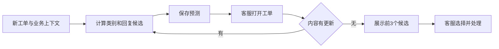

# 企业成功实践深读：客服辅助怎样真正做成

补充调研日期：2026-10-08。这里深读两个独立企业的产品实践：Uber COTA 的 v1→v2，以及阿里 AliMe Assist→KBQA。每个产品的迭代放在同一案例内；它们提供了**真实业务流程、方法选择、效果数字和改进原因**，不是把多个版本算成多家企业。

最值得借鉴的成功经验是：**先明确工作人员或系统要作出的决定，再定义所需信息；让业务结构与文本检索互补；用下游任务效果决定结构化是否值得。** 两个系统都没有采用一张包办所有场景的“通用抽取字段表”。

本文的 C01/C02 是实践编号，P18/P19/P20 是新增论文编号。论文书目、来源缓存摘要和逐项证据定位分别见[论文记录](sources/enterprise-papers.json)、[实践证据记录](sources/enterprise-practice.json)和[检索日志](sources/enterprise-practice-search-log.jsonl)；[BibTeX](sources/enterprise-references.bib)可直接导入文献管理工具。原文均为作者公开预印本，正式出版信息另用精确 DOI 核对；本文不声称这些旧版系统仍是企业 2026 年的当前实现。

## 1. 两个案例各自解决了什么

| 案例 | 真正的业务任务 | 有内容依据的成功结果 | 最直接可借鉴之处 |
| --- | --- | --- | --- |
| C01：Uber COTA | 帮客服从大量类别和回复模板中选择合适候选 | 英语工单生产 A/B：平均工单处理时长约减少 10%；离线 v2 回复模板 Hits@3 为 75.21%，v1 为 72.07% | 原文和可靠业务上下文共同参与；展示候选供人选择；评价前几名是否有用 |
| C02：AliMe Assist→KBQA | 中文为主的客户问答、任务服务，以及带复杂条件的商家促销规则问答 | Assist 的意图 precision 为 89.91%，SVM+MaxEnt 基线为 82.71%；KBQA 在另三个匿名业务场景报告解决率绝对提升 7.88、4.90、3.24 个百分点 | 按任务定义槽位；把实体、属性、约束分开；归一化和结构查询保精度，检索补覆盖 |

COTA 的业务效果来自作者报告的随机分组线上实验；AliMe KBQA 的业务效果来自作者生产报告，未给出同等完整的随机对照设置。**处理时长、意图 precision、会话解决率分别回答不同问题，不能相互当作抽取准确率。** 下文保留它们各自的定义。

## 2. C01：Uber COTA——先帮助客服选对候选，再逐步增加模型能力

主要来源：Molino、Zheng、Wang，2018，*COTA: Improving the Speed and Accuracy of Customer Support through Ranking and Deep Networks*，ACM KDD。[正式 DOI](https://doi.org/10.1145/3219819.3219851)；[作者全文](https://arxiv.org/pdf/1807.01337)。重点读了 PDF 第 2–8 页的系统、模型、实验和生产评估。

### 2.1 起点是两个具体决定

客服打开工单后，先识别属于哪一种问题，再选对应回复模板。类别和模板都有数千种，类别树有七层。COTA 将这两个决定明确为两个相关目标：`contact type` 与 `reply template`。

它使用四组输入：

| 输入组 | 原文给出的例子 | 对本项目的启示 |
| --- | --- | --- |
| 工单文本 | 用户提交的问题描述 | `case_content` 本身就是有效输入；应保留原文基线 |
| 工单元数据 | 创建时间、产品类型 | 已有可靠字段可直接使用，无须让模型从文字重新猜 |
| 用户信息 | 司机/乘客等用户类型、国家 | 上下文会改变适用类别或政策；使用时要有真实数据来源 |
| 行程信息 | 城市、预计到达时间、行程状态 | 相似表述的处理方式可能因业务状态不同而改变 |

这些上下文来自业务系统；论文并没有说它们全部由工单正文抽取得到。它也没有先要求生成“投诉内容、地址、主体、影响”等通用字段后才能预测。[P18，§§2.1–2.2，PDF p.2]

### 2.2 人工不是流程外的补救环节

作者明确写道：“The top three ranked predictions are suggested to agents”。展示三条是产品界面选择，评价因此采用 Hits@3。客服仍作最终决定；缓存预测并在工单更新后重算，减少打开页面时的等待，也避免继续使用旧内容的结果。[P18，§2.1，PDF p.2；§5.1，p.6]

**可迁移经验：** 我们的历史案例检索也可以先服务于“工作人员能否快速找到可参考案例”。候选列表的有用性、原文证据和选择时间，是自然的验收对象。COTA 的候选是类别/模板，我们的候选是历史案件，不能直接继承其命中率。

### 2.3 v1 成功的关键是改变问题形式

v1 并未从复杂深度模型起步。它清理文本、分词并作词形处理，用 TF-IDF 和 LSA 得到表示；从历史工单构造每个类别/模板的表示，再计算新工单与候选的相似度，加入业务特征，用随机森林为“工单—候选”逐对打分。回复模板自身的文本也参加相似度计算。

这比直接把工单一次分类到数千标签更适合当时的问题。表 2 中，回复模板 Hits@3 从直接多类分类的 **53.15%** 变成逐点排序的 **72.07%**；两个目标同时预测正确的比例从 **31.90%** 变成 **45.52%**。[P18，§§3.2–3.3，PDF p.3；Table 2，p.7]

这里的经验不是要求本项目换成随机森林，而是：**历史文本及候选内容本身可以作为匹配依据，先找候选、再比较候选具有实际成功先例。** 本项目已有词法、向量与重排能力，研究增量应优先解释“结构化信息能补掉哪种匹配错误”。

### 2.4 v2 把业务关系变成模型关系

v2 的 Encoder–Combiner–Decoder 分别编码文本、类别型特征、数值特征，再合并。两个设计直接对应业务结构：

- **类别有层级：** 预测从根节点到目标类别的路径，而不是把所有类别当作完全独立标签。预测到正确类别的父节点，在客服操作上仍可能比跳到另一大类更有用。
- **回复依赖问题类型：** 回复解码器接收类别解码器的信息，让两个输出保持一致。表 4 中，有依赖时联合正确率为 53.12%，没有依赖时为 40.12%。

这些变化告诉我们：“地址出现了”“现象出现了”“诉求出现了”三个判断分别正确，仍不保证它们属于同一投诉事项。**关联正确性值得独立定义和检查。** 这是项目迁移解释；COTA 本身并未做中文投诉多事项抽取。[P18，§4.2，PDF p.5；Table 4，p.7]

### 2.5 成功数字应怎样读

训练和评价数据约 300 万条历史工单，随机划分为约 280 万训练、9.4 万验证、9.4 万测试；问题类别和回复模板均为长尾分布。下面是论文表 5 的离线比较，数值差按原始数值计算为百分点：

| 指标 | COTA v1 | COTA v2 | 差值 |
| --- | ---: | ---: | ---: |
| 类别 Top1 正确率 | 49.13% | 65.68% | +16.55 个百分点 |
| 类别 Hits@3 | 67.16% | 72.58% | +5.42 个百分点 |
| 回复模板 Hits@3 | 72.07% | 75.21% | +3.14 个百分点 |
| 类别与回复同时正确 | 45.52% | 53.12% | +7.60 个百分点 |

[P18，§5.2，PDF p.6；Table 5，p.7]

生产实验在英语工单上把数千名客服随机分为两组：对照组使用没有推荐的原界面，实验组看到 COTA 类别及模板推荐；分析只由对应组客服处理完成的工单。作者报告**平均处理时长约降低 10%**，`p≈10⁻⁸`；满意度总体相同或略高。[P18，§5.8，PDF p.8]

这 10% 是时间的相对降低，不是检索准确率提升 10 个百分点。原文没有给出精确分组人数、试验时长、两组绝对处理时长或可核算的总体满意度增幅，也没有将该线上结果单独归因于 v2 相比 v1 的更新。本报告因此把它记为 **COTA 整体辅助流程的生产效果**。

### 2.6 失败分析比“用了深度学习”更有用

**第一，低频和过时标签拖累效果。** 论文发现常见类别表现更好，部分旧类别因业务季节变化变得很少使用；提出补充相关元数据、整合不用的类别和模板。模型差错有一部分来自业务标签和数据分布，不能全靠换更大的模型解决。[P18，§5.7，PDF pp.7–8]

**第二，最佳离线分数不等于最佳产品选择。** 表 1 中，字符 C-RNN 的类别正确率为 65.05%，Word CNN 为 64.33%；评估整个验证集分别耗时 17.5 分钟与 2 分钟。团队采用更快的 Word CNN。这里的分钟数是完整验证集的评估用时，不能解释成单条工单延迟。[P18，§5.3/Table 1，PDF p.6]

**第三，指标要对应界面动作。** 若工作人员只能查看前几项，前几名是否出现正确候选就比“所有候选都能排序”更有意义。本项目也应先确定工作人员怎样使用检索结果，再决定是否主要评价 Recall@K、NDCG、选择时间或多项组合。

## 3. C02：AliMe——从分工明确的中文客服，到处理复杂条件

主要来源：

- P19：Li 等，2017，*AliMe Assist: An Intelligent Assistant for Creating an Innovative E-commerce Experience*，CIKM。[正式 DOI](https://doi.org/10.1145/3132847.3133169)；[作者全文](https://arxiv.org/pdf/1801.05032)，预印本发布于 2018 年。
- P20：Li、Chen、Huang、Guo，2019，*AliMe KBQA: Question Answering over Structured Knowledge for E-Commerce Customer Service*，Springer 书章。[正式 DOI](https://doi.org/10.1007/978-981-15-1956-7_12)；[作者全文](https://arxiv.org/pdf/1912.05728)。它提供的是同一产品家族在复杂商家问题上的后续经验。

### 3.1 先分清要完成什么任务，字段随任务变化

Assist 将需求区分为任务协助、业务问答、闲聊。不同任务采用不同处理方式：

| 任务 | 怎样定义要提的信息 | 实际方法 |
| --- | --- | --- |
| 订票等任务协助 | 先规定必填和选填槽位，例如出发地、目的地、日期 | 字典与模式填槽；缺少必填信息时继续询问 |
| 业务问题 | 识别业务意图、知识实体以及用户表达与规范知识的对应 | 规则与 CNN 意图分类；语义解析；知识图谱查询 |
| 闲聊 | 产生可接受的聊天回复 | 候选回复检索、Seq2Seq 重排/生成等单独流程 |

论文对任务型服务的明确做法是“define a schema that specifies the mandatory and optional slots for a task”。这对字段设计的启发十分具体：**先写这个信息如何影响一个动作，再决定是否必须提取它。** “订票一定要目的地”是业务要求；“历史案例检索一定要完整投诉地址”则需要我们的检索任务证据。[P19，§§3.1–3.2，PDF p.2]

它的业务问答流程也并非单一模型：规则处理明确业务模式；意图分类确定场景；语义解析识别知识标签；查询知识图谱；缺答案时尝试一次与上一轮问题拼接；仍缺时根据已识别信息澄清或转入检索；最后按意图转人工。论文明确说，图谱只覆盖常见知识子集，因此检索用来提高覆盖。[P19，§2，PDF pp.1–2；§3.3，p.3]

### 3.2 如何让各种口语说法对应同一问题

Assist 的知识建设不是凭空让模型生成标签。其步骤是：

1. 从知识文本抽取候选名词、动词，结合分词、词性、TF-IDF 和互信息形成候选实体。
2. 由业务分析师复核实体，定义关系和层级。
3. 在历史客服对话中寻找与已知知识项相似的答复，收集对应问题的不同说法。
4. 从这些表达挖掘模式，帮助新问题映射到规范知识实体。

[P19，§3.3，PDF p.3]

这给我们提供了两条可用经验：一是**原文表达与规范概念分开保存**；二是**历史数据可用来找同义表达和边界样例**。但投诉场景中“办理答复相同”可能只表示套用了同一回复模板，不能直接认定投诉问题相同。因此历史匹配宜作为待复核候选，不能自动变成可靠标签。

### 3.3 不要把不同子系统的漂亮数字混在一起

P19 的意图实验覆盖 40 种意图、67,797 个实例，其中训练 47,455、测试 20,342。作者报告：

| 方法 | 原文称为 precision 的结果 |
| --- | ---: |
| SVM + MaxEnt 组合基线 | 82.71% |
| CNN，不加语义标签 | 89.00% |
| CNN，加入当前问题及上一问题的语义标签 | 89.91% |

语义标签相对 CNN 的增量为 **0.91 个百分点**，不是把 CNN 相比旧基线的全部收益都归功于结构化。原文没有说明该 precision 的宏/微平均方式；也没有在这里评价地点槽位或实体角色准确率。[P19，§3.1，PDF p.2]

Assist 报告每天处理百万级问题、能 address 85%；知识图谱相对传统检索的“accuracy 增加 10%”缺少同页的具体分母和基线值，因此本文不据此算一个精确的通用收益。论文另有闲聊 A/B，2,136 个问题上的 Top1 可接受率为 60.36% 对 40.86%，**该数字属于闲聊回复，不用于证明业务问答或投诉抽取成功**。[P19，§§3.3–4，PDF p.3]

### 3.4 为什么继续做 KBQA：单纯“相似问题匹配”碰到了边界

到了商家促销规则场景，团队观察到两类问题：

- **知识重复：** 不同提问实际询问同一规则，例如“一个账号能绑定几个手机号”和“绑定时为什么提示超出限制”。每次都维护独立 QA 对，容易重复建设。
- **相同实体的关系不同：** 同一句里有活动、促销工具、价格，某个活动可能限定某种价格，另一个实体可能是该活动的参加方式。只识别这些词出现过，不足以决定问的是什么。

因此 KBQA 为知识表示增加了属性层级、键值文本与 CVT 条件表。CVT 可以通俗理解成一张**答案有自己的列、适用条件有各自列的表**。先识别问题中的实体和属性，再识别哪些条件限定这次查询。[P20，§§1–2，PDF pp.1–5，尤其 Table 1 与 Fig.1]

对应的查询实现是：Trie 识别实体→遮盖实体名称后用 CNN 预测候选属性→用规则/字符串相似度识别约束并绑定→LambdaRank 排序候选查询图→回答时取 Top1，推荐时取 Top3→需要时沿已定义的类型关系推理。[P20，§3，PDF pp.6–7]

这与“住在甲地，投诉乙地问题”的关联：**甲地和乙地都被找到只是第一步，哪一个在限制本次问题才是第二步。** 对本项目可以借鉴这种任务分解；是否需要图谱，要看实际错误是否值得图谱的建设成本。

### 3.5 有哪些可核对的生产收益

作者报告在 2018 年双 11 商家营销活动场景中，121 个属性（其中 73 个关联 CVT）覆盖原先 320 个 QA 对，系统服务超过 100 万个问题，会话解决率为 90% 以上。[P20，§4，PDF pp.7–8]

这里“解决率”的定义是 `1 - 未解决会话数 / 全部会话数`；未解决包括点踩、无答案和明确要求人工的会话。**百万级的量是问题数，解决率的分母是会话数，二者不能混写。** 原文还称相对传统 QA 表示和问题匹配“高 10-percent”、满意度增加 10%，但未交代清楚这些差值的相对/绝对口径、样本分配或随机化方法；不把它们升级为可独立复算的因果效果。

更便于理解的结果是另外三个业务场景的表 2：

| 后续场景（作者匿名） | 原 QA 对数 | 结构化后的属性数 | 作者报告解决率绝对增量 |
| --- | ---: | ---: | ---: |
| Scenario-1 | 232 | 78 | +7.88 个百分点 |
| Scenario-2 | 776 | 73 | +4.90 个百分点 |
| Scenario-3 | 870 | 72 | +3.24 个百分点 |

[P20，Table 2 及其上文，PDF p.8；上文明确将此组结果称为 absolute increase]

属性数更少意味着需要匹配和标注的目标可以更集中，但 **QA 对数与属性数不是相同单位的存储量，也不是延迟测量**。真正的工程经验在于复用：同类型促销活动沿用 schema，业务人员主要填充新活动的值，许多属性训练样例也可复用。作者报告，在双 11 实践后，为类似双 12 场景上线只用了一个工作日。这个数字是已有系统的增量迁移时间，不是从零建设整个系统的工期。[P20，§2 末段，PDF p.6]

### 3.6 它的边界与失败经验同样具体

**图谱的精度依赖覆盖。** 2017 年图谱只覆盖高频知识，所以保留检索；2019 年能获得较强效果的商家规则场景，其知识也经过业务人员整理。不能据此假设任意自由投诉都能直接套到已有结构里。

**schema 建设仍然有人工成本。** P20 的结论仍把降低人工 schema 建设成本、改善条件识别列为未解决问题；其实体识别模块注明在当时业务中不需要消歧。这一前提不适用于同名小区、道路简称等政务地址问题。[P20，§3 脚注 3，PDF p.6；§6，p.11]

**少一个条件，可能改变答案。** P20 的示例存在默认槽位，正文中同一优惠组合的答案描述也有前后不一致。本文只使用其结构和流程证据，不把该优惠规则的真假作为可靠业务知识。对投诉抽取的可迁移要求是：原文未给出的地址、状态、责任主体应有明确缺失表示，不因某业务系统有默认值就照搬默认补全。[P20，PDF pp.7–9]

**行为指标需要内容抽查补充。** 没有点踩、没有要求人工的会话仍可能没有得到正确答案。把该定义转到本项目时，还需要工作人员对案例相关性及字段证据作判断。

## 4. 把成功经验转成我们下一轮应验证的内容

下表是研究推导出的候选检验，不是已确定的新字段或实现方案。

| 成熟实践中的做法 | 对本项目可以怎样检验 | 通过检验才有理由推进什么 |
| --- | --- | --- |
| COTA 保留原始文本，并加入真实业务上下文 | 原始 `case_content` 检索与增加结构信息后的结果并排比较 | 结构化是否补掉原文匹配错误，而非只让输出更整齐 |
| COTA 类别和回复有关联，联合正确另计 | 多事项样例中检查“现象—地址—诉求”是否错配 | 是否需要显式事项编号、角色或关系约束 |
| AliMe 槽位由任务定义 | 每个候选字段写明影响召回、排序、关联、限制条件还是展示 | 哪些是核心字段，哪些可以缺失或后置 |
| AliMe 将说法归一到受管理的概念 | 保留原文与规范说法，检查是否丢了否定、时间和业务条件 | 能否使用规则、标签映射或模型归一化 |
| AliMe 结构查询与检索后备并存 | 单独查看低频、模糊地址、复杂多事项的漏召回 | 是否应软加权，还是有足够证据使用硬过滤 |
| 两家都按业务失败继续改造 | 将错误归为漏信息、错角色、无依据补全、候选没召回、重排错误 | 下一次投入应放在字段规范、抽取、索引还是重排 |
| COTA 看前几名及客服处理时间 | 在人工相关性评价之外，观察选择候选是否更快 | 离线提升能否转成工作人员可感知的效果 |

对“投诉内容”和“投诉地址”的字段讨论，现在可以更具体：**原始投诉叙述、用于匹配的规范问题表示、地址原文、地址在事项中的角色，应先作为不同需求来讨论。** 外部成功经验说明这些分工有价值；本项目是否需要把它们做成独立字段，要由原文样例、下游用法和错误对照决定。

## 5. 本轮证据处理说明

纳入 3 篇具有正式出版信息的论文，分别支持 2 个企业产品案例；不把同一企业的版本或同一论文的多张表当作独立部署证据。所有主要结果均查到原文相应段落或表格，源文件哈希与阅读范围保存于 JSON。没有部署这些外部系统，也没有用本项目投诉跑模型。

Uber 官方博客请求返回 406/429，ACM 论文页返回访问挑战；随后使用公开的 arXiv 作者稿，并用 Crossref 精确 DOI 核对书目。检索日志保留了失败和不相关搜索结果。本文聚焦可解释的成功与迭代经验，不是截至 2026 年的模型性能排行榜。
