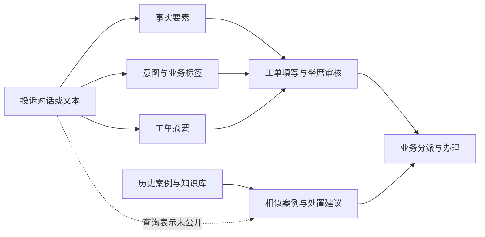

# 政务热线实践：哪些做法已经进入真实业务

补充调研日期：2026-10-08。案例编号 C04–C06，与本专题其他实践报告共用编号体系。

这轮不再只问“能抽什么字段”，而是追踪投诉从进入系统，到形成工单，再到找到类似处置经验的完整过程。最贴近本项目的是湛江：公开材料把**要素提取、结构化摘要、标签推荐、历史相似案例、坐席审核**放在同一个业务系统里。张家口补充了“历史数据与权责规则怎样共同参与判断”，海淀补充了“统一事件分类和复用成功处置经验”的经验。

三地均有实际应用报道，但尚无可复现的抽取/检索评测集。下面把已披露的业务动作、报道中的成效和本项目可试的方法分别写清楚；不把部署宣传当成本项目效果证明。

## 1. 先看三个案例各解决了什么

| 案例 | 最值得学习的具体做法 | 公开证据能到哪一步 |
| --- | --- | --- |
| C04 湛江 12345 | 将事实要素、意图/标签、摘要和相似案例分成不同能力，嵌入既有业务系统，由坐席审核确认；后续材料显示事项配置同时包含标签、牵头单位和办理层级 | 市政府上线报道、建设方部署说明、行政服务中心后续运行材料；可以核对接口集成和业务功能，抽取提示词、检索算法未公开 |
| C05 张家口 12345 | 语义理解与历史工单比对、权责库匹配共同派单；根据处置反馈优化分派，并保留回访人工抽查 | 省政府报道及后续地方官方报道；可以核对流程组合，不能还原各模块训练/检索实现 |
| C06 海淀“接诉即办” | 先将要素与统一事件类目结合，再支持派单、相似成功经验辅助处置、专题分析等不同用途 | 政府平台转载采访、标明“数据来源：百度”的建设方案报道；有已应用的流程与历史效果快照，没有开放代码/评测协议 |

## 2. C04：湛江把“字段、摘要、历史案例”放在同一条工作流程里

### 2.1 系统、输入和部署事实

湛江市 12345 政务服务便民热线于 **2025-02-19** 接入 DeepSeek。市政府次日发布的报道明确列出六项能力：意图理解、标签推荐、要素提取、对话小结、自动填单、知识挖掘。其中知识挖掘包括关联历史相似案例、推送处置建议。[C04-S01](https://www.zhanjiang.gov.cn/zwgk/zwzt/szzf/mtbd/content/post_2012483.html)

输入是市民来电及对话，输出进入既有业务系统和工单流程。对本项目而言，已经保存的 `case_content` 对应其中的文本理解部分：可以先研究文本的处理与案例检索，后续实时接入时再增加语音转写和对话增量处理。

建设方中国电信的公开说明给出了比“接入大模型”更具体的实施动作：在本地部署其所称的“70b 版本 DeepSeek-R1”，打通政务云和 12345 系统间的调用链路，**基于已有 12345 知识库开发标准化数据接口**，将模型服务 API 对接现有业务系统，并复用现有政务云基础设施。[C04-S02](https://m.thepaper.cn/baijiahao_30229407) 原文没有给出精确 checkpoint、量化方式、推理框架或 GPU 配置，不能由“70b”反推具体权重，更不能据此决定本项目 V100/H100 的模型选型。

政府报道与建设方说明互补：前者说明业务能力，后者说明如何接进原有系统。它们不是两次独立准确率评测。

### 2.2 把三种“结构化结果”的用途分开看

| 公开的输出或动作 | 在湛江材料中的用途 | 对本项目最直接的启发 |
| --- | --- | --- |
| 时间、地点、涉事单位等要素 | 从对话抓取信息、自动填入工单 | 这些信息适合核对“在哪里、何时、涉及谁”，以及比较案例的适用条件 |
| 诉求实际意图 | 区分如“水管爆裂”和“水费纠纷” | 只出现同一个对象词“水”，并不代表是同一类问题；问题表示需保留发生了什么、希望解决什么 |
| 20 大类、156 小类诉求标签 | 推荐分类，支持业务转派 | 分类连接业务规则；标签可以是检索线索，但标签相同仍不等于案例处置方式适用 |
| 通话结束后的结构化工单摘要 | 减少手工整理与细节遗漏 | 摘要负责概括完整问题；不宜把它与地址等逐项事实值混成一个无法检查的长字符串 |
| 关联历史相似案例、推送处置建议 | 辅助工作人员决策 | 检索结果应能回到历史原文和处置记录，让工作人员判断是否可借鉴 |
| 自动填单后坐席审核确认 | 由人工检查模型整理的工单 | 先做“可修改的助手”就是明确的落地形态，并不需要等全自动抽取完全成熟 |

上表前两列来自 C04-S01，第三列为本项目的迁移分析。公开材料**没有**说明时间/地点/单位分别如何标注、如何判断地点角色，也没有说明检索实际使用摘要、要素还是两者。因此，我们借鉴的是“这些结果各负其责”的工作组织方式，具体查询表示仍需比较。

可以按下面的功能关系理解这一案例；这是依据报道整理的关系图，并非供应商披露的实际调用时序：

### 2.3 持续运行材料补上了“规则谁来维护”

湛江市人民政府行政服务中心 **2026-02-24** 的后续材料再次介绍该应用，并披露事项治理动作：梳理诉求事项、给事项打标签、明确牵头单位、设定办理层级，同时实行职责清单化和首接负责制。[C04-S04，“颗粒归仓”“制度先行”](https://www.zhanjiang.gov.cn/xzfwzx/gkmlpt/content/2/2151/mpost_2151064.html)

这比一个模型名称更有可迁移价值：**问题类别与谁负责、按什么层级办理一起维护，模型输出才能接上业务动作。** 后续材料提到的 4191 项“事项清单”和 2025 年的 20/156 级分类标签属于不同口径，不能写成类别数从 156 自动升级至 4191。

对我们的案例检索，可以先把“投诉问题”和“历史处理动作/结果”分开保存，在展示时一起供人核对；如果以后需要按部门或行政区域限制结果，应使用明确维护的规则或元数据。这里是项目建议，尚未在本地实现或验证。

### 2.4 成效怎样读才有用

| 官方上线报道的数字 | 数字实际对应什么 | 当前可支持的结论 |
| --- | --- | --- |
| 意图识别准确率 98.3% | 意图识别；报道未披露测试样本、分母或人工审核口径 | 可作为当地报道的上线效果记录，不能代替字段抽取 F1 |
| 人工记录 5 分钟 → 自动生成 10 秒 | 要素记录/生成这个环节 | 说明优化目标是减少整理时间；未披露测时协议、人工修订时间 |
| 单件处理 8 分钟 → 2 分钟 | 自动填单与坐席审核相关的处理流程 | 值得把“人工审核后的总耗时”列为本项目后续指标；不能当成纯模型推理延迟 |

三项均来自 C04-S01 的 2025 年上线报道，不是本次复测。报道还列出 2024 年的 99.97% 按时办结率；该时间早于模型接入，本报告不把它列作模型成效。原始地方报道与政府转载是同一报道链，来源登记中保留了关联，避免重复计算为独立证据。[C04-S03](https://www.gdzjdaily.com.cn/p/2912673.html)

**可借鉴的成功经验**：复用已有知识库和工单界面；把自动整理结果交给坐席确认；同时提供便于理解的摘要、可核对的要素和可追溯的历史案例。这样很早就能提供工作价值，也能从人工修改中积累真正的改进样例。最后一句关于积累样例是本项目建议，报道没有披露湛江是否已将这些修改用于训练。

## 3. C05：张家口用历史经验加权责规则约束判断

### 3.1 业务流程中不是只有一个语言模型

河北省政府 **2025-03-05** 报道，张家口 12345 已接入 DeepSeek，形成语音录入、知识库直办、智能派单、回访与趋势分析的组合。对本项目最有用的是三个连接点：[C05-S01](https://www.hebei.gov.cn/columns/b522d086-e11d-44ec-ab13-d0f18b711de3/202503/05/88c8ba55-1c87-4fb8-b13a-b75c3430b53a.html)

1. 先识别诉求、提取关键词并归类问题，再形成结构化工单。
2. 派单同时使用**语义分析、历史数据比对和权责库匹配**，将诉求关联到服务领域或职能部门。
3. 根据处置反馈优化分派单位；回访采用短信、智能电话和人工抽查核验的组合。

据本报告归纳，这些动作分别承担不同作用：投诉内容告诉系统发生了什么，历史案例提供此前怎样处理，权责清单提供当前由谁处理的业务依据。公开报道没有说明三者采用哪种评分融合，也没有说明“动态优化”是否等同于在线模型训练。

### 3.2 后续报道增加了可操作的细节

张家口文明网 **2026-01-30** 转载当地采访，列出的录入信息包含群众电话、**事发地点、具体诉求**，并提到录入阶段的实时错误检测与纠正。知识库环节通过问题关键词与语义匹配定位政策条款，再结合历史案例帮助组织答复；派单继续结合历史工单和权责清单。[C05-S02](http://www.zjkwmw.gov.cn/contents/1001/18685.html)

这里有两个值得留下的经验。第一，录入业务确实需要明确到“事发地点”，而非无差别搜集所有地名；但材料没有给出其地点角色识别规则。第二，**历史案例和政策条款承担不同作用**，前者是经验，后者是当前规则依据。历史处理过不代表现在也能照做，查询结果最好能显示来源和适用时间。这是从其系统组合得到的项目解释。

后续报道中的“DeepSeek 语音识别”是整个系统的新闻表达，本报告不据此推断所用语言模型权重具有原生语音能力；录入校验的具体规则也未公开。群众电话是其联络流程所需，不构成本项目将个人联系方式加入检索语义的理由。

### 3.3 公开效果与最值得复制的动作

2025 年省政府报道记录每日智能生成工单 2000 余条、工单准确率 99.5%、分拨准确率超过 95%、话务员直接答复率 78%。这些是不同环节的业务指标，原文未给出准确率评测协议。2026 年报道另写每日 2500 条、派单准确率 99.5%；两个时间点的采样与分母未公开，不能拼接成受控的模型提升曲线。[C05-S01、C05-S02]

本项目最值得借鉴的不是这些数字，而是**“检索到相似案例后，还要检查当前约束，并记录使用者的反馈”**。未来如果工作人员认为某案例不适用，应能记录原因，例如地点辖区不同、问题不同、政策过期、处理条件不满足。按错误原因改进检索，比单独追求字段完整率更贴近使用效果。该反馈分类是本报告提出的实验记录方式，尚非张家口公开 schema。

## 4. C06：海淀先统一事件表示，再让同一批数据支持不同工作

### 4.1 已应用的整体做法

海淀区城市管理指挥中心、百度智能云与中科大脑合作，将文心大模型用于“接诉即办”。**2024-05-23**《人民日报》刊载的材料明确标注“数据来源：百度”，其中说明：[C06-S01](https://paper.people.com.cn/rmrb/html/2024-05/23/nw.D110000renmrb_20240523_4-11.htm)

- 智能派单：实时提取工单要素，与事件类目标签结合，形成海淀区事件分类标签体系，辅助工单分拣和派发。
- 智能处置：以定制模型为承办单位提供助手，根据以往类似事件的成功处置经验帮助办理。
- 智能分析：围绕事件、时空、行业开展分析；面向业务数据库支持查询及报告生成。

这不是一个仅输出 JSON 的抽取演示，而是把同一份事件信息接到了派单、办理和分析三种业务。可复制的思路是**先让核心问题有一致的表达，再按不同任务组合信息**，而不是为了多个用途不断往一份自由摘要里塞内容。

### 4.2 哪些失败经验值得提前吸收

天津市数据发展中心转载《瞭望》的后续报道描述了海淀此前的痛点：受理量大、涉及部门多、类型杂，人工标签统计标准不一，增加派单、处置、统计和预警的难度。[C06-S03，“抢占人工智能产业应用制高点”海淀段](https://tjdsj.tjcac.gov.cn/tjsg/202512/t20251224_7205949.html)

这给当前字段研究一个实际理由：不同人把同一种问题写成不同标签，会同时影响后续检索和统计；模型也需要统一的标签定义和例子。另一方面，海淀材料没有公开完整类目表、长尾类别处理办法和定制模型训练参数，因此不能直接照抄其标签数量或模型路线。

“类似事件的成功处置经验”也提醒我们考虑案例库质量。后续可区分历史记录是否包含具体处理动作、是否有结果依据，而不是默认所有历史文本都有同样参考价值。**这是本项目对来源的迁移建议**；原文未说明海淀采用怎样的成功案例筛选和排序算法。

### 4.3 历史成效快照及适用范围

国际科技创新中心政府平台 **2023-08-15** 转载《北京日报》采访，报道智能派单引擎可识别 836 种派单类型、准确率达 87% 以上，并提到结合城市事件库、知识图谱处理事件。[C06-S02，“牵手大模型的生长演进”](https://www.ncsti.gov.cn/kjdt/yqdy/yqdt/202308/t20230815_131259.html)

这是 2023 年系统的公开快照，不是前述 2024 年定制模型的统一测试结果。来源没有披露测试集、人工审核流程或各类别结果；“836”是报道中的派单类型规模，不是我们应设计 836 个字段。对本项目的价值在于证明城市级业务已经围绕类目、事件库和模型进行组合应用，而不是证明其中任何单一模块必然最好。

## 5. 把成功经验转成下一轮有方向的比较

三地材料给出的共同经验是：**先让人更容易看懂和使用投诉，再逐步提高自动化程度；文本理解与业务规则、历史案例、人工处理相互衔接。** 这支持本项目继续沿“`case_content` 处理 → 历史案例查询”的两部分推进，而不要求先重建一个完整热线平台。

| 下一轮值得试的动作 | 实践依据 | 在本项目中怎样判断有没有帮助 |
| --- | --- | --- |
| 保留原文，同时比较简短问题摘要与事实要素 | C04 的摘要、要素分工；C06 的事件表示复用 | 相同投诉分别用原文、摘要、摘要加要素查询，人工比较前列历史案例是否更有参考价值 |
| 核对地点的作用、具体问题和诉求，先关注会改变匹配的内容 | C04 的意图区分；C05 的事发地点、具体诉求 | 错误的地点归属或遗漏诉求，是否把结果引向另一类问题 |
| 让审核者可修改结果，并记录修订原因 | C04 自动填单后坐席审核；C05 录入校验和处置反馈 | 统计修订负担、修改后查询结果变化及最常见错误；不只统计字段有没有值 |
| 历史案例展示原始投诉、处理动作和结果依据 | C04/C06 的类似处置经验；C05 的历史案例加当前规则 | 评审者是否能判断该案例适用，以及为何不适用 |
| 业务类目与规则独立维护，避免模型自由编造部门/职责 | C04 的标签、牵头单位、办理层级；C05 权责库 | 仅在有可靠规则和元数据时引入限制；比较它带来的准确性与漏召回 |

以上是**有外部实践依据的试验方向**，不是冻结字段设计。优先比较那些会改变案例排序的信息，便能把“字段边界”从抽象争论转为具体问题：哪一处提取或概括帮助找到了更合适的历史案例，哪一处反而造成误检。

## 6. 来源与核验范围

原始标题、发布日期、逐项证据定位、短摘录和缓存 SHA-256 见 [civic-practice.json](sources/civic-practice.json)；实际查询、失败访问和页面抓取记录见 [civic-practice-search-log.jsonl](sources/civic-practice-search-log.jsonl)。缓存只用于本地核验，受本项目 `research/.gitignore` 保护，不纳入 Git。

本轮取得 3 个真实业务案例的公开证据，其中湛江有业务方与建设方材料及后续运行报道。未取得任何一地公开的完整抽取 schema、提示词、训练集、检索打分代码或受控评测协议。因此本报告支持学习其工作流程和集成方法，不声称复现了模型性能。部分海淀区官网检索命中页已返回 404，未据搜索片段补造正文；本报告使用可正常读取的政府平台、原刊及建设方署名内容。
