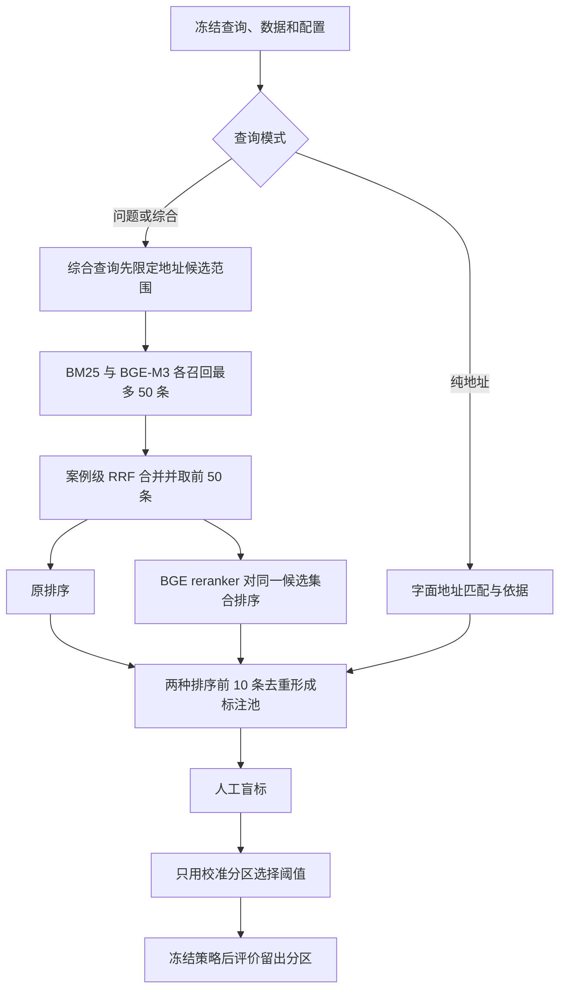

# 第一阶段开发计划：案例检索恢复与人工相关性评测

版本：v1.0  
制定日期：2026-10-03（北京时间）  
状态：开发计划，尚未执行本阶段新增任务  
起始代码：`main / 36a0a50`  
前置盘点：[项目进度与续开发建议](项目进度与续开发建议_2026-10-03.md)

## 1. 阶段目标与交付判断

项目面向“新投诉受理辅助”：输入投诉问题、地点或二者组合，找到有依据的相关历史案例，帮助使用者了解背景。

第一阶段回答一个具体问题：**在固定的历史案例库与混合检索候选上，加入重排及相关性过滤，能否让返回的前 5 条案例更符合问题和地点要求？**

本阶段交付一套可复现的小规模实验：恢复运行环境与索引，建立真实查询集，完成候选收集、人工标注、校准、留出评价和错误分析。完成后，应能据实决定保留原排序、采用重排继续试点，或优先修复某类检索问题。

“实验流程完成”和“方法效果提高”分别验收。重排没有收益、阈值无法校准、证据不足，均允许成为最终结论；不能为了完成计划而调整标签、删除困难查询或降低预设目标。

预计投入 **20–32 小时，分 5–7 个工作日推进**。其中人工标注及复核预计 6–10 小时。该估计以服务器已有可复用模型和向量索引为前提，不包含排队、下载、重新全量编码及等待业务人员的时间；先试标 20 对再修正标注工时。

## 2. 开发范围

| 内容 | 本阶段安排 | 交付边界 |
| --- | --- | --- |
| 运行恢复 | 必做 | 核验服务器产物、模型和数据版本，重建不兼容地址索引 |
| 问题 / 地址 / 综合查询 | 必做 | 保留现有三模式，并进行真实库功能检查 |
| 真实查询与人工标签 | 必做 | 10 个独立场景、30 条查询；保存来源、划分、标准和审核记录 |
| 重排效果 | 主实验 | 同一 hybrid 候选集合的原排序与重排排序比较 |
| 相关性过滤 | 有条件实验 | 仅在校准集找到合格阈值时生成策略并评价 |
| BM25 与 dense | 恢复和功能验证 | 本阶段不作三种召回路线优劣的统一人标结论 |
| 多召回路线共同标注池 | 后续独立任务 | 现有工具仅支持单个 run 内 baseline/reranked 的共同池 |
| 在线 API、查询页面、实际坐席效率试验 | 第二阶段 | 本阶段的结果将决定默认路线和页面展示重点 |
| Qwen 抽取、问答生成、自动派单、事件合并 | 后续按证据立项 | 第一阶段检索继续使用案例原文 |

此次评价不使用历史知识引用作为案例相关性标签。原有知识引用评测的冻结测试集继续保留。已有 20 条抽取工作表属于另一条实验线，不替代本阶段的查询—案例标注。

## 3. 已有基础和启动条件

截至前置盘点，本地有 400,120 个历史检索文档及正式 BM25 索引；BM25 真实查询可运行。代码已具备 BGE-M3、案例级 RRF、地址约束、BGE reranker 和人工评测流程。

已有材料须按以下口径使用：

- BM25 的 80.17% 是历史知识引用 Recall@10，不能作为本阶段案例相关性成绩。
- 文档中的 hybrid 83.62% 尚需取回服务器原始报告核验。
- 本地旧地址缓存与当前 `address.py` 指纹不一致，需用当前代码在新目录重建。
- 本地没有真实模型权重和 dense/reranker 正式实验产物；先检查服务器，避免重复下载和编码。
- 前置检查全量单测为 133 passed、2 skipped；两项 POSIX 权限测试另在 WSL 中覆盖。这是起点记录，新增代码后仍须运行对应检查。

启动主实验的条件：数据、词法索引、向量索引、地址索引和模型指纹相互匹配；实际解释器及依赖版本明确；三种查询模式和 reranker 小样本加载成功。若 dense 或 GPU 尚未恢复，可并行做查询准备、标注规范及 BM25 功能检查，主实验记录为等待依赖。

## 4. 技术方案与冻结配置

### 4.1 检索和比较路径



`problem` 模式在全历史库检索。`combined` 模式先取得所有满足地址规则的案例，再在该集合内进行问题检索，不把全库 Top 50 后过滤当作等价实现。`address` 模式使用地址名称匹配，不执行语义重排。

| 实验路线 | 定义 | 作用 |
| --- | --- | --- |
| A：baseline | hybrid RRF 的前 5 条 | 主对照 |
| B：reranked | 同一 hybrid Top 50 经重排后的前 5 条 | 判断固定候选内的排序是否改善 |
| C：filtered | B 按冻结阈值过滤后最多返回 5 条 | 判断减少低相关结果的收益与覆盖代价 |

纯地址模式在三列中的排序保持相同，只用于地址能力检查；重排收益主要分析 `problem` 和 `combined`，避免地址查询稀释结果。当前单个 run 的共同标签不可直接当作 BM25/dense/hybrid 跨 run 的统一标签，池内 nDCG 也不能跨不同标注池直接比较。

### 4.2 默认配置

| 配置项 | 第一版规定 |
| --- | --- |
| 历史数据 | 现有冻结的 400,120 文档快照，记录 manifest SHA256 |
| 检索字段 | `case_content` |
| 词法候选 | SQLite FTS5 BM25，`max_terms=32`，最多 50 条 |
| 语义候选 | 本地 BGE-M3 与现有 FAISS 索引，最多 50 条 |
| 融合 | 案例级等权 RRF，常数 60，去重后保留最多 50 条 |
| 地址约束 | 使用当前解析器；`allow_broader=false`；不静默忽略不支持的精细地址条件 |
| 重排 | BGE-reranker-v2-m3，候选原文，最多 50 条 |
| 表征参数 | 复用已验证索引配置；当前默认 embedding max_length=8192、float16 |
| 重排参数 | max_length=1024、batch_size=4、float16；模型身份与权重哈希冻结 |
| 标注池 | 原排序、重排各前 10 条并集 |
| 评价预算 | K=5；`pooled_nDCG@5` |
| 校准规则 | 每个语义查询模式 `returned_precision >= 0.9`，至少 5 个返回结果、覆盖 3 个查询 |

模型已有 revision/文件指纹优先保留，重新准备时记录确切版本。0.9 是经验校准的选择目标，不能作为预期总体准确率。正式候选收集前可以用额外演练查询排查环境问题；正式收集后改变模型、候选预算、文本处理或打分参数，须使用新实验版本重新收集。

## 5. 查询集设计与隔离

### 5.1 第一版规模

选择一个明确的场景范围，默认从物业及小区公共环境投诉开始；先按数据与正文核对是否有足够样本。样本不足时，在检索候选生成之前记录范围调整。

选择 **10 个独立真实投诉场景**，每个场景形成三种查询：

- `problem`：根据实际诉求表达核心问题，不增加原文没有的条件。
- `address`：使用该场景中有依据、且当前解析器支持的命名地点或道路信息。
- `combined`：相同问题加明确的地址约束。

形成 30 条查询：6 个完整场景进入 `calibration`（18 条），4 个完整场景进入 `evaluation`（12 条）。同一事件、明显关联投诉、同一场景的改写和三种模式只能属于一个分区。

30 条查询只有 10 个独立场景。留出部分每种模式只有 4 条，能够评价重排变化的仅 8 条问题/综合查询。本阶段定位为探索性实验，不能报告总体准确率或统计显著提升。

### 5.2 查询来源与选取

优先采用实际新增、尚未进入历史索引的投诉。若暂时没有这类输入，使用现有 `dataset.sqlite3` 中 `split=dev` 的记录，排除已用于原 200 条开发查询的关联组及已知调试样本；采用固定种子排序与事先规定的场景资格筛选，形成候选清单供人工核对。

采用现有 dev 来源时，报告须明确称为“开发期未使用记录构成的探索性留出样本”，不宣称生产新流量测试。不开启原有 `queries.test.jsonl` / `qrels.test.jsonl` 来选择新实验查询。

每个场景在私有 `query-provenance.jsonl` 记录：`scenario_id`、来源类型、源记录 ID/源行号、内容哈希、关联组、场景选择理由、原意核对人、查询改写说明和人工近重复审查结论。未持有外部源记录时保留可验证的本地来源引用，不补造 ID。

抽样与查询改写不查看检索排名或模型分数；不能因为查询无结果而换掉它。冻结前可检查地址语法是否受支持，但地址是否有候选、是否有相关结果都属于待测结果。

### 5.3 冻结前检查

1. 30 个 `query_id` 唯一，10 个场景各含三种模式；综合查询有显式地址。
2. 同一事件/关联场景不跨分区；记录固定分区方式、随机种子及任何人工分组原因。
3. 源记录不是历史候选库中的同一记录，关联组及规范化相同正文不与历史语料重叠；人工检查明显同事件转述，记录处理决定。
4. 未使用检索效果、引用标签或模型判断决定查询资格。
5. 保存查询、来源清单、配置、协议版本和 SHA256；完成后才收集正式候选。

自动检查能发现 ID、正文哈希和已知关联组问题；语义近重复和真实业务意图仍需要人工核对，不能声称已自动消除全部泄漏。

## 6. 人工评价规范

### 6.1 工作量与职责

标注单位为一对“查询—历史案例”。20 条问题/综合查询，每条最多 20 个去重候选；10 条地址查询，两路线相同，每条最多 10 个候选，合计最多 **500 对**。实际数量由候选池确定；这比只阅读每条查询前 5 条的 150 对更多，是为了公平评价排序变化。

用户或业务人员负责意图确认和最终标签；开发助手负责准备表格、检查格式、计算指标和整理错误，不能替代人工填写金标。

正式标注前，用额外演练样本试标约 20 对，明确争议口径并估计工时。演练场景不进入正式留出评价。正式表格隐藏路线、排名、分数和分区；这是对算法来源的盲标，不宣称严格双盲。

### 6.2 评分规则

| 分数 | 问题相关性 `problem_grade` | 地点相关性 `address_grade` |
| --- | --- | --- |
| 2 | 核心问题及明确要求的关键条件直接符合 | 目标地点有明确依据，显式限定不冲突 |
| 1 | 主题相关，但核心细节、条件或依据不足 | 地点范围较宽、具体限定缺失或同名身份有歧义 |
| 0 | 核心问题不同、明确事实冲突 | 地点冲突或与目标地点无关 |

`problem` 只要求问题分；`address` 只要求地点分；`combined` 两项都填，最终等级取 `min(problem_grade, address_grade)`。只有最终等级为 2 才计为直接相关。

举例：同小区“楼道无人打扫”与“消防通道停车”问题不同；另一小区的“楼道无人打扫”可以满足纯问题查询，但不满足限定小区的综合查询。没有楼栋证据时不能推断楼栋一致。历史问题已解决并不自动意味着无关：若查询只是寻找同类历史案例，仍按问题与地点评分；查询明确要求“尚未解决”时才额外核对状态依据。

保留备注记录冲突、歧义、长文、解决/撤回背景、时间限定等原因。必填空格表示未标注，评分必须拒绝；不能把空格记成 0。

### 6.3 标注复核与冻结

优先安排第二人独立复核约 20% 的候选，按模式抽样，并覆盖关键争议项；记录初始标签、分歧及最终裁决。若只有一人，采用隔日打乱顺序复核，报告如实标为单人标注，不声称双人一致性。

标注人可阅读正文完成所有判断；模型及方案选择在标注前冻结，阈值只能由 calibration 的标签按规定规则计算。策略冻结前不读取 evaluation 的指标作决策。若同一人兼任开发和标注，应明确这一限制，禁止根据所见留出案例回头修改模型、规则和参数。

最终保存标签副本、SHA256、标注人、时间、协议版本和复核记录。冻结后修改标签必须记录原因，并对全部候选方法统一重算。

## 7. 最低必要开发任务

以下是待开发任务，不能视为已有命令或已实现能力。优先复用当前 `CaseSearcher`、`case_eval` 和模型适配器。

| 编号 | 任务及建议位置 | 开发内容 | 完成检查 |
| --- | --- | --- | --- |
| D01 | 运行预检：新增 `retrieval_baseline/preflight.py`，必要时增加 deploy 包装脚本 | 只读检查实际 Python、依赖、CUDA、数据/索引/模型配套关系；记录文件核验和真实推理检查的不同状态 | 缺文件或指纹不配套时明确失败；输出不含投诉正文和私有环境变量值 |
| D02 | 查询冻结：扩展 `retrieval_baseline/case_eval.py` 或独立查询准备模块 | 保存真实查询来源；检查分区、ID、规范化正文、已知关联组；将人工近重复审查列为必填审查项 | 存在跨分区泄漏、库内自匹配或未完成来源审查的正式查询不能冻结 |
| D03 | 批量计时：`case_eval.py::collect` | 分别记录搜索器初始化、reranker 首次加载、检索、重排打分、每查询整体和整批耗时 | 使用假时钟/受控依赖验证计时归属；明确嵌套计时不能相加，旧报告字段保持可识别 |
| D04 | 报告整理：新增 `retrieval_baseline/case_report.py` 或等价小型报告模块 | 从结果和标签生成分模式表、场景配对变化、空结果清单、错误统计；单独保留问题/地点判断 | 数值与原始 JSON/TSV 一致；仅输出聚合信息的公开版与含原文的私有诊断分开保存 |
| D05 | 文档和小量回归测试 | 更新 RERANKING 操作说明，明确配置、目录、校准失败分支；测试新逻辑的关键失败边界 | 现有回归通过；新增检查能拒绝来源混用、漏标和非法分区；shell 语法通过 |

现有 `collect` 的 `seconds_search_this_query` 继承 baseline 计时，并不包含其外部执行的完整重排和模型加载。D03 完成前，不把该字段称为“检索＋重排端到端耗时”。

本阶段不要求新增地址别名库或更细地址解析；遇到当前不支持的精细条件，按既有行为明确拒绝并记录。若确需改变解析器，先完成变更、测试和索引重建，再冻结正式实验。

## 8. 开发与执行流程

| 步骤 | 工作与负责人 | 时间估计 | 阶段产物 / 放行条件 |
| --- | --- | ---: | --- |
| P0：恢复与盘点 | 助手核验；用户提供已有服务器路径/访问条件 | 3–5 小时 | 环境、模型、数据及已有实验清单；缺失项明确；确定执行主机 |
| P1：补齐最小开发 | 助手完成 D01–D05 的必要部分 | 4–6 小时 | 新逻辑关键测试通过；完整计时与查询来源检查可用 |
| P2：查询与协议冻结 | 助手准备候选；用户确认真实意图与标签口径 | 2–3 小时 | 30 查询、来源审核、6/4 场景划分、配置和协议哈希 |
| P3：收集与导出 | 助手运行；GPU用于 query encoding / reranker，CPU用于地址索引和导出 | 1–2 小时 | 完整 run manifest；共同标注池及空池查询记录 |
| P4：人工标注与复核 | 用户/业务人员判定；助手只作格式检查 | 6–10 小时 | 所有必填标签完成，争议裁决和复核记录齐全 |
| P5：校准与留出评价 | 助手按冻结规则运行 | 2–3 小时 | 未筛选结果必出；阈值成功或失败均有记录；留出集评价完成 |
| P6：诊断与下一阶段决策 | 助手出报告；用户结合案例解释确认 | 2–3 小时 | 逐场景收益/退化、错误类型、成本记录、下一步有依据 |

没有 GPU 时，P0 的资料归档、D01/D02/D04、查询准备及标注规范可继续推进。若需重新编码全部历史文档，将其作为新增依赖单独估时；不得把首期计划的 20–32 小时当作全量编码承诺。

建议开发分支为 `codex/case-relevance-phase1`，按预检、查询冻结、计时报告分成可审查的小提交；正式收集前固定代码提交。实验产物不覆盖，失败目录保留，新尝试使用 `run-002` 等新目录。

## 9. 预期产物与目录

计划文档保留在项目根目录。业务文本、查询、来源、标签和诊断均保存到 Git 已忽略的私有目录；下面的文件名是本阶段产物约定，当前尚未生成：

```text
data/case-relevance-phase1-v1/
  protocol.md                     实验问题、范围、口径、配置与冻结时间
  preflight.json                  实际环境及产物核验结果
  inventory.json                  已有服务器产物、版本和待恢复项
  queries.json                    30 条正式查询
  query-provenance.jsonl          真实来源、分组及改写/近重复审查
  freeze-manifest.json            协议、查询、来源、配置及代码版本
  address-index-v1/               当前实现重建的地址索引
  run-001/
    queries.json
    runs.jsonl
    manifest.json
  labels-001/
    judgments.tsv                 人工填写的标签
    manifest.json
  review-log.jsonl                标注人、复核与裁决记录
  calibration-status.json         成功或失败及其原因
  policy-001.json                 仅校准成功时生成
  evaluation-unfiltered.json      baseline / reranked 留出结果
  evaluation-filtered.json        仅策略有效时生成
  error-analysis.md               私有逐场景错误分析
  acceptance.md                   各验收项与证据路径
```

地址索引若已经存在经当前代码验证的正式版本，可以在清单中引用它而不再复制。公开结果文档只保留聚合指标、实验配置和限制，不包含投诉原文、真实地点及记录 ID。

## 10. 当前已有命令的执行顺序

以下命令均对应当前已实现入口，是后续执行参考；本次制定计划不运行它们。D01/D02/D04 的新入口在实现后补入本节。先进入实际部署仓库，确认 `conda` 为目标主机的真实可用命令。

### 10.1 环境与已有权重检查

```bash
bash deploy/check-reranker-env.sh
bash deploy/download-retrieval-model.sh --verify-only
bash deploy/download-reranker-model.sh --verify-only
bash deploy/run-dense-baseline.sh check
```

准备/检查脚本不读取 `deploy/.env.retrieval`，采用自定义模型路径或环境名时须显式传递一致的环境变量；运行脚本则会读取该私有文件。`check` 涉及实际编码，应在具备相应设备的任务内执行。已有权重核验通过后不重复下载。

### 10.2 地址索引与查询草稿

在私有 `deploy/.env.retrieval` 中将 `RETRIEVAL_ADDRESS_INDEX` 指向新的、尚不存在的目标目录，例如 `data/case-relevance-phase1-v1/address-index-v1`，然后执行：

```bash
bash deploy/run-case-search.sh prepare-address
bash deploy/run-case-evaluation.sh init-queries --output data/case-relevance-phase1-v1/queries.json
```

`init-queries` 只生成 30 条示例。必须按第 5 节替换为已审核的真实场景，填写来源记录并通过新增冻结检查后才能进入下一步；不能直接把示例当真实评价集。

### 10.3 正式收集与人工标注

```bash
bash deploy/run-case-evaluation.sh collect --queries data/case-relevance-phase1-v1/queries.json --output data/case-relevance-phase1-v1/run-001 --retriever hybrid --case-k 50
bash deploy/run-case-evaluation.sh export --run data/case-relevance-phase1-v1/run-001 --output data/case-relevance-phase1-v1/labels-001 --depth 10
```

用 Excel 或支持 UTF-8 TSV 的编辑器打开 `labels-001/judgments.tsv`，仅填写对应等级、事件备注和 notes；保留原始列、行及正文。按第 6 节完成标注复核，再冻结标签。

### 10.4 校准与冻结

```bash
bash deploy/run-case-evaluation.sh calibrate --run data/case-relevance-phase1-v1/run-001 --labels data/case-relevance-phase1-v1/labels-001 --output data/case-relevance-phase1-v1/policy-001.json --k 5 --target-precision 0.9 --min-results 5 --min-queries 3
```

仅使用 calibration 标签。若没有任何满足规则的阈值，记录失败原因到 `calibration-status.json`，不生成假策略、不降低标准、不看留出指标调参。问题模式或综合模式之一失败时，当前整体策略构建可能失败，应如实记录，不宣称两个模式均已校准。

### 10.5 留出评价

策略成功或失败均须生成原排序与重排的比较：

```bash
bash deploy/run-case-evaluation.sh evaluate --run data/case-relevance-phase1-v1/run-001 --labels data/case-relevance-phase1-v1/labels-001 --output data/case-relevance-phase1-v1/evaluation-unfiltered.json --partition evaluation --k 5 --ndcg-k 5
```

只有已生成有效、冻结策略时，执行三路线比较：

```bash
bash deploy/run-case-evaluation.sh evaluate --run data/case-relevance-phase1-v1/run-001 --labels data/case-relevance-phase1-v1/labels-001 --policy data/case-relevance-phase1-v1/policy-001.json --output data/case-relevance-phase1-v1/evaluation-filtered.json --partition evaluation --k 5 --ndcg-k 5
```

评价后的任何模型/参数修改属于下一轮实验；新增未见评价场景，不能继续将同一批留出标签称为未见测试。

## 11. 指标、预期结果与验收

### 11.1 指标口径

| 指标 | 定义与用途 |
| --- | --- |
| Precision@5 | 每条查询前 5 条中 grade=2 的数量 / 5，再取查询平均；返回 3 条且全相关时仍为 0.6 |
| pooled nDCG@5 | 考虑 0/1/2 等级及排序位置；理想排序仅限共同人工池，无正增益时为 null 并报告分母 |
| returned_precision | 实际返回前 5 条中的 grade=2 总数 / 实际返回总数；全不返回时为 null |
| query_coverage / mean_returned | 至少返回一条的查询比例 / 平均返回条数；用来解释过滤的覆盖代价 |
| 有用结果覆盖 | 至少返回 1 条 grade=2 案例的查询比例，由逐查询结果派生；区别于有结果就算的 query_coverage |
| 问题/地点错误 | 从两类原始等级和备注统计，明确区分问题不符、地点冲突和证据不足；不称为地址抽取 Recall |
| 时间与成本 | 报告硬件、初始化、加载、检索、重排、截断/OOM、有效计时数量；不从一次批次推断线上 SLA |

主报告分别展示 problem、combined、address，并展开 4 个留出场景的配对结果。可以附全体平均，但不把同场景三种查询当作三个独立样本；本期不新增显著性宣称。

空候选、无已观察正例池、收集失败必须单独列出。Top 10 并池无法发现两种排序共同漏掉的相关案例，因此不报告全库案例 Recall，不把“未找到”写成“库里不存在”。

### 11.2 必须完成的工程与实验验收

- [ ] 环境、模型、数据、词法/向量/地址索引版本可追溯，指纹不一致能被拒绝。
- [ ] 三种模式功能可运行；综合查询返回候选均在地址规则允许集合内，纯地址查询不调用语义重排。
- [ ] 30 条正式查询及真实来源审核完成；同场景不跨分区；原冻结测试集未用于调试。
- [ ] 正式候选集合、原排序和重排排序保存完整，同一查询重排前后候选 ID 与原文一致。
- [ ] 共同池所有必填标签有效，复核与争议记录可追溯；无标签不按负例计数。
- [ ] 阈值只读取 calibration；策略成功/失败均有记录，失败时仍产出未筛选对照结果。
- [ ] 留出评价可从冻结产物重算；报告与机器结果数值一致，覆盖率与精度同时展示。
- [ ] 逐场景错误分析及下一步行动完成；即使无改善也保留完整结果。
- [ ] 新改动的必要回归、模块 lint 和 shell 语法检查通过；既有 data_analysis lint 遗留单独记录，不扩大本阶段修改范围。

### 11.3 根据结果作决策

| 实际结果 | 结论与后续 |
| --- | --- |
| 留出样本 P@5 提高，相关结果排名前移，代价可接受 | 将重排列为第二阶段可选默认候选；扩充未见场景继续验证 |
| P@5 相近，nDCG 有改善 | 记录为排序位置改善，结合具体案例决定是否值得增加成本 |
| 过滤提高返回精度，但有用结果覆盖下降 | 明确展示取舍；不能仅靠高精度决定采用 |
| 重排无改善或出现明显退化 | 保留原排序，按问题歧义、地址、截断、候选缺失等原因确定下一项开发 |
| 阈值无法校准或留出证据太少 | 保留未筛选结果；增加新的校准/评价场景，不为了达标降低既定规则 |
| 场景来源或标签可靠性不足 | 先补数据与标注，暂缓算法优劣判断 |

没有业务依据时，不预先承诺“P@5 达到 80%/90%”“延迟低于某个数字”或“必然优于 BM25”。本阶段预期得到可复核的测量结果与下一步决策，不以得到某个漂亮数值作为完成标准。

## 12. 下一次开发从哪里开始

下一次执行先做 P0：核对服务器已有模型、dense/hybrid 报告和索引，确定运行环境与需恢复项；随后实现只读预检、查询来源冻结及完整计时。正式收集之前完成真实场景选择和标签口径演练。

只有第一阶段验收完成后，再基于实际表现确定第二阶段的检索默认路线、API 与页面交互，并开展“找到有用案例所需时间”等使用任务评价。
