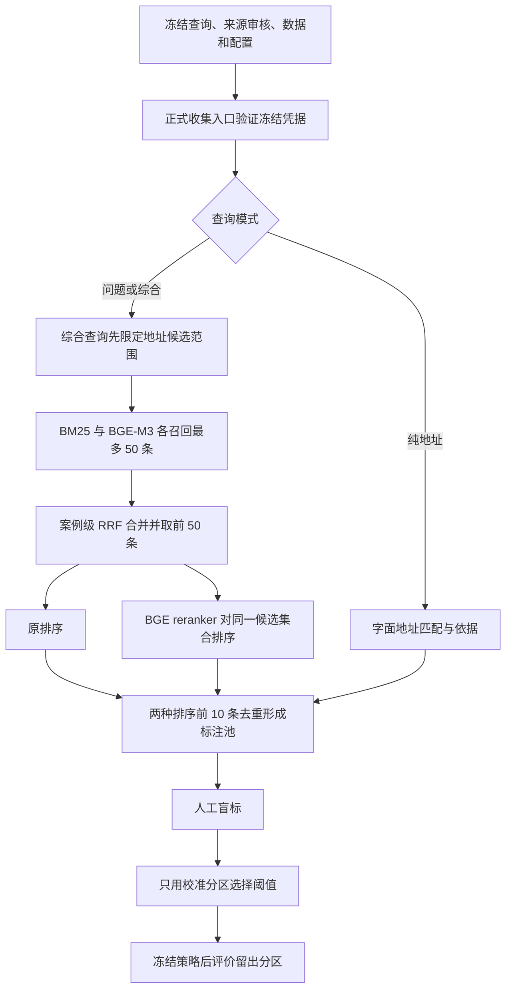

# 第一阶段开发计划：案例检索恢复与人工相关性评测

版本：v1.1（审核补齐版）  
制定日期：2026-10-03（北京时间）  
修订日期：2026-10-03（北京时间）  
状态：D01–D07 工程实现完成；真实 H100 联合预检与人工实验待执行  
起始代码：`main / 36a0a50`  
前置盘点：[项目进度与续开发建议](项目进度与续开发建议_2026-10-03.md)  
修订依据：[v1.0 审核意见](第一阶段开发计划_v1.0_审核意见.md)；[v1.0 原稿归档](第一阶段开发计划_案例检索与人工评测_v1.0_归档.md)

v1.1 将冻结入口、重复查询处理、信息时点审核、标签与策略失效、异常状态纳入正式开发任务，并补齐组级抽样、盲标编号、阈值择优及错误归因规则。本轮已实现对应代码和回归测试；实际完成证据见[开发交付记录](第一阶段开发交付记录_2026-10-03.md)。工程完成不代表真实检索效果已经验证。

## 1. 阶段目标与交付判断

项目面向“新投诉受理辅助”：输入投诉问题、地点或二者组合，找到有依据的相关历史案例，帮助使用者了解背景。

第一阶段回答一个具体问题：**在固定的历史案例库与混合检索候选上，加入重排及相关性过滤，能否让返回的前 5 条案例更符合问题和地点要求？**

本阶段交付一套可复现的小规模实验：恢复运行环境与索引，建立真实查询集，完成候选收集、人工标注、校准、留出评价和错误分析。完成后，应能据实决定保留原排序、采用重排继续试点，或优先修复某类检索问题。

“实验流程完成”和“方法效果提高”分别验收。重排没有收益、阈值无法校准、证据不足，均允许成为最终结论；不能为了完成计划而调整标签、删除困难查询或降低预设目标。

按第 7、8 节修订后的任务拆分，预计投入 **27–44 小时，约 6–9 个工作日推进**，其中最小开发 10–17 小时，人工标注及复核 6–10 小时。这是计划估计，以服务器已有可复用模型和向量索引为前提，不包含排队、下载、重新全量编码及等待业务人员的时间；P0 后复核开发估计，先试标 20 对再修正标注工时。

## 2. 开发范围

| 内容 | 本阶段安排 | 交付边界 |
| --- | --- | --- |
| 运行恢复 | 必做 | 核验服务器产物、模型和数据版本，重建不兼容地址索引 |
| 问题 / 地址 / 综合查询 | 必做 | 保留现有三模式，并进行真实库功能检查 |
| 真实查询与人工标签 | 必做 | 10 个独立场景、30 条查询；保存来源、划分、标准和审核记录 |
| 重排效果 | 主实验 | 同一 hybrid 候选集合的原排序与重排排序比较 |
| 相关性过滤 | 有条件实验 | 仅在校准集找到合格阈值时生成策略并评价 |
| BM25 与 dense | 恢复和功能验证 | 本阶段不作三种召回路线优劣的统一人标结论 |
| 多召回路线共同标注池 | 后续独立任务 | 现有工具仅支持单个 run 内 baseline/reranked 的共同池 |
| 在线 API、查询页面、实际坐席效率试验 | 第二阶段 | 本阶段的结果将决定默认路线和页面展示重点 |
| Qwen 抽取、问答生成、自动派单、事件合并 | 后续按证据立项 | 第一阶段检索继续使用案例原文 |

此次评价不使用历史知识引用作为案例相关性标签。原有知识引用评测的冻结测试集继续保留。已有 20 条抽取工作表属于另一条实验线，不替代本阶段的查询—案例标注。

## 3. 已有基础和启动条件

截至前置盘点，本地有 400,120 个历史检索文档及正式 BM25 索引；BM25 真实查询可运行。代码已具备 BGE-M3、案例级 RRF、地址约束、BGE reranker 和人工评测流程。

已有材料须按以下口径使用：

- BM25 的 80.17% 是历史知识引用 Recall@10，不能作为本阶段案例相关性成绩。
- 文档中的 hybrid 83.62% 尚需取回服务器原始报告核验。
- 本地旧地址缓存与当前 `address.py` 指纹不一致，需用当前代码在新目录重建。
- 本地没有真实模型权重和 dense/reranker 正式实验产物；先检查服务器，避免重复下载和编码。
- 前置检查全量单测为 133 passed、2 skipped；两项 POSIX 权限测试另在 WSL 中覆盖。这是起点记录，新增代码后仍须运行对应检查。

启动主实验的条件：数据、词法索引、向量索引、地址索引和模型指纹相互匹配；实际解释器及依赖版本明确；三种查询模式可用，且在同一实际进程完成 hybrid 检索与 reranker 联合小样本推理。记录 GPU 型号/显存、主存、磁盘可用量、实际 dtype 和批大小，不能仅以两个模型分别加载成功代替联合验证。正式收集还须通过第 5.4 节的冻结验证。若 dense 或 GPU 尚未恢复，可并行做查询准备、标注规范及 BM25 功能检查，主实验记录为等待依赖。

## 4. 技术方案与冻结配置

### 4.1 检索和比较路径



`problem` 模式在全历史库检索。`combined` 模式先取得所有满足地址规则的案例，再在该集合内进行问题检索，不把全库 Top 50 后过滤当作等价实现。`address` 模式使用地址名称匹配，不执行语义重排。

| 实验路线 | 定义 | 作用 |
| --- | --- | --- |
| A：baseline | hybrid RRF 的前 5 条 | 主对照 |
| B：reranked | 同一 hybrid Top 50 经重排后的前 5 条 | 判断固定候选内的排序是否改善 |
| C：filtered | B 按冻结阈值过滤后最多返回 5 条 | 判断减少低相关结果的收益与覆盖代价 |

纯地址模式在三列中的排序保持相同，只用于地址能力检查；重排收益主要分析 `problem` 和 `combined`，避免地址查询稀释结果。当前单个 run 的共同标签不可直接当作 BM25/dense/hybrid 跨 run 的统一标签，池内 nDCG 也不能跨不同标注池直接比较。

### 4.2 默认配置

| 配置项 | 本版规定 |
| --- | --- |
| 历史数据 | 现有冻结的 400,120 文档快照，记录 manifest SHA256 |
| 检索字段 | `case_content` |
| 词法候选 | SQLite FTS5 BM25，`max_terms=32`，最多 50 条 |
| 语义候选 | 本地 BGE-M3 与现有 FAISS 索引，最多 50 条 |
| 融合 | 案例级等权 RRF，常数 60，去重后保留最多 50 条 |
| 地址约束 | 使用当前解析器；`allow_broader=false`；不静默忽略不支持的精细地址条件 |
| 重排 | BGE-reranker-v2-m3，候选原文，最多 50 条 |
| 表征参数 | 复用已验证索引配置；当前默认 embedding max_length=8192、float16 |
| 重排参数 | max_length=1024、batch_size=4、float16；模型身份与权重哈希冻结 |
| 标注池 | 原排序、重排各前 10 条并集 |
| 评价预算 | K=5；`pooled_nDCG@5` |
| 校准规则 | 每个语义查询模式 `returned_precision >= 0.9`，至少 5 个返回结果、覆盖 3 个查询 |
| 阈值择优 | 各模式重排 Top 5 的观测原始分数作为阈值候选；`score >= threshold`；合格阈值中先最大化返回数量，再取更低阈值 |
| 策略发布 | problem、combined 两种模式均校准成功才发布整体策略；本期不发布仅一种模式有效的策略 |
| 运行与计时顺序 | 冻结查询执行顺序；额外演练使用独立进程，正式批次单独记录首次加载、后续查询及整批耗时 |

模型已有 revision/文件指纹优先保留，重新准备时记录确切版本。0.9 是经验校准的选择目标，不能作为预期总体准确率。正式候选收集前可以用额外演练查询排查环境问题；正式收集后改变模型、候选预算、文本处理或打分参数，须使用新实验版本重新收集。

## 5. 查询集设计与隔离

### 5.1 第一版规模

选择一个明确的场景范围，默认从物业及小区公共环境投诉开始；先按数据与正文核对是否有足够样本。样本不足时，在检索候选生成之前记录范围调整。

选择 **10 个独立真实投诉场景**，每个场景形成三种查询：

- `problem`：根据实际诉求表达核心问题，不增加原文没有的条件。
- `address`：使用该场景中有依据、且当前解析器支持的命名地点或道路信息。
- `combined`：相同问题加明确的地址约束。

形成 30 条查询：6 个完整场景进入 `calibration`（18 条），4 个完整场景进入 `evaluation`（12 条）。同一事件、明显关联投诉、同一场景的改写和三种模式只能属于一个分区。

30 条查询只有 10 个独立场景。留出部分每种模式只有 4 条，能够评价重排变化的仅 8 条问题/综合查询。本阶段定位为探索性实验，不能报告总体准确率或统计显著提升。

本期采用**查询定义全局唯一**的最小方案：按现有加载器去除查询及地址首尾空白，以 `(mode, query, address)` 检查全部 30 条，不仅检查分区内部。不同场景同一地点会造成纯地址查询重复；不同地点相同诉求也可能造成纯问题查询重复。任何一种模式重复，该候选场景整体不入选，记录原因后按固定次序继续选下一组。人工同时排除只靠虚词、标点或无意义改写规避检查的样本；不得换 ID 跨分区复用同一查询。

报告披露此规则对同地点、多次同类投诉的筛选偏差。本期不增加重复查询复用和重新计权机制。正式放行仍要求 10 场景、30 查询和 6/4 划分；不足时在查看检索结果前调整范围并重走筛选。确需缩小规模，必须先修改实验协议版本，同步查询数、分区数、标注预算、校准支持量解释、指标分母和验收，不将不足规模的试跑当作本计划已完成。

### 5.2 查询来源与选取

优先采用实际新增、尚未进入历史索引的投诉。若暂时没有这类输入，使用现有 `dataset.sqlite3` 中 `split=dev` 的记录，按以下规则选择，过程不读取检索结果：

1. 排除原 200 条开发查询、已知调试和本阶段演练样本所属的整个关联组；保存带版本及哈希的 `source-exclusions.json`。无法完全核实的调试历史写入来源限制，不宣称已全部排除。
2. 每个剩余关联组先固定选择最小 `rid` 的代表记录，再按 `stable_rank(seed=42, source_id)` 排序；不采用先随机抽记录再去重的方式。外部新增来源没有内部 rid/group_id 时，先记录可核对的关联分组与稳定代表键，再冻结等价规则，不补造数据库 ID。
3. 依次审核代表记录的场景范围、信息时点、地址语法支持、原意与近重复情况，以及第 5.1 节的查询定义唯一性；每组最多入选一个场景，取得 10 个合格场景即停止。代表记录不合格时不临时换同组另一条记录来争取入选。
4. 在 `sampling-audit.jsonl` 保存候选组总数、排序与代表规则、逐组审核结果、排除原因及停止位置。按“原开发/调试或演练组、范围不符、已知后验信息、地址不支持、关联/近重复、重复查询定义”等固定顺序记录首个排除原因，其他原因作附注，避免排除总数重复计数。
5. 对入选的完整场景，以代表记录 source_id（外部来源采用已冻结的稳定代表键）计算 `stable_rank(seed=43, key)` 排序，前 6 个分配 calibration，后 4 个分配 evaluation；后续人工发现关联时，重新完成分组、筛选与划分并保留修订记录，冻结后不凭效果移动分区。正式 query_id/scenario_id 在划分后生成不带入选顺序或分区语义的不透明编号，保存私有映射。

采用现有 dev 来源时，报告须明确称为“开发期未使用记录构成的探索性留出样本”，不宣称生产新流量测试。不开启原有 `queries.test.jsonl` / `qrels.test.jsonl` 来选择新实验查询。

每个场景在私有 `query-provenance.jsonl` 记录：`scenario_id`、来源类型、源记录 ID/源行号、内容哈希、关联组、场景选择理由、原意核对人、查询改写说明和人工近重复审查结论。未持有外部源记录时保留可验证的本地来源引用，不补造 ID。

来源审核还必须记录 `query_as_of`（拟模拟的受理时点，可为未知）、`information_basis`（查询所用信息及当时可知的证据）、`removed_followup_information`（后续原因/处理结果/最终状态的剔除说明）、`temporal_review_status` 和审核人。既有 `call_time` 只用于时间切分，不证明正文就是受理时版本。已知属于后续处理的信息不得写入初始诉求；无法构造独立于这些信息的查询时排除该候选。

时点审核结论区分“受理时可知有证据”“时点证据不足、仅作导出文本构造查询”“不合格”；未知时间保留未知。第二类可作为事先声明的后备来源入选，但必须在协议及结果中单列数量，并将该实验明确称为“基于导出文本构造查询的探索性实验”，不声称实际线上时点回放。审核完成不等于所有样本均已证实受理时可知。

抽样与查询改写不查看检索排名或模型分数；不能因为查询无结果而换掉它。冻结前可检查地址语法是否受支持，但地址是否有候选、是否有相关结果都属于待测结果。

### 5.3 冻结前检查

1. 30 个 `query_id` 及全部查询定义唯一，10 个场景各含三种模式；综合查询有显式地址，且问题部分与同场景 problem 查询一致。
2. 同一事件/关联场景不跨分区；记录固定分区方式、随机种子及任何人工分组原因。
3. 源记录不是历史候选库中的同一记录，关联组及规范化相同正文不与历史语料重叠；人工检查明显同事件转述，记录处理决定。
4. 来源、组级抽样日志、排除清单及信息时点审核完整；不合格候选已排除，时点证据不足样本的结论边界已写入协议。
5. 未使用检索效果、引用标签或模型判断决定查询资格；query_id/scenario_id 不含 dev/eval、源记录、入选次序等可透露分区的信息。
6. 保存查询、来源清单、抽样记录、配置、协议版本、代码版本及 SHA256；通过第 5.4 节入口验证后才收集正式候选。

自动检查能发现 ID、正文哈希和已知关联组问题；语义近重复和真实业务意图仍需要人工核对，不能声称已自动消除全部泄漏。

### 5.4 正式收集的强制冻结验证

D02 必须将冻结验证接入实际 `collect`，不能仅生成一份可被绕过的检查报告。`freeze-manifest.json` 至少包含 schema/协议版本、实验标识、冻结时间、审核完成状态、上述输入文件哈希、预检记录哈希、数据/三类索引/模型身份、实际生效配置、代码提交及会影响实验的源码指纹。显式参数、部署环境变量和默认值合并后的实际配置须与冻结值一致。

正式收集在模型加载和候选生成之前验证上述文件及配置；缺少清单、审核未完成、输入改变、相关源码偏离冻结提交/指纹时明确失败。模型和索引使用文件哈希/已有 manifest 核验身份，再运行已冻结配置；不以路径相同代替内容相同。不相关文件的修改不作为拒绝条件。

完成的 run manifest 写入 `experiment_kind=formal` 和冻结清单 SHA256；标注池、标签冻结、校准尝试、策略及报告均绑定该 run，保持完整追溯。下游正式入口同样验证这些关系。旧接口用于演练时必须显式传入 `--drill`，缺少正式凭据不得进入正式标签和指标。实际命令见第 10 节和服务器手册。

## 6. 人工评价规范

### 6.1 工作量与职责

标注单位为一对“查询—历史案例”。20 条问题/综合查询，每条最多 20 个去重候选；10 条地址查询，两路线相同，每条最多 10 个候选，合计最多 **500 对**。实际数量由候选池确定；这比只阅读每条查询前 5 条的 150 对更多，是为了公平评价排序变化。

用户或业务人员负责意图确认和最终标签；开发助手负责准备表格、检查格式、计算指标和整理错误，不能替代人工填写金标。

正式标注前，用额外演练样本试标约 20 对，明确争议口径并估计工时。演练场景不进入正式留出评价。正式表格隐藏路线、排名、分数和分区；这是对算法来源的盲标，不宣称严格双盲。

盲标使用第 5 节冻结前已生成的不透明编号，私有 `query-id-map.json` 保存编号、场景、来源和分区映射，不随工作表交给标注人。沿用候选哈希排序打乱呈现顺序；不能让标注人在导出后手改 ID，否则会破坏现有完整性校验。由实际使用的 Excel/编辑器完成少量含长文、换行、中文的演练表格往返保存检查，再导出正式工作表。

### 6.2 评分规则

| 分数 | 问题相关性 `problem_grade` | 地点相关性 `address_grade` |
| --- | --- | --- |
| 2 | 核心问题及明确要求的关键条件直接符合 | 目标地点有明确依据，显式限定不冲突 |
| 1 | 主题相关，但核心细节、条件或依据不足 | 地点范围较宽、具体限定缺失或同名身份有歧义 |
| 0 | 核心问题不同、明确事实冲突 | 地点冲突或与目标地点无关 |

`problem` 只要求问题分；`address` 只要求地点分；`combined` 两项都填，最终等级取 `min(problem_grade, address_grade)`。只有最终等级为 2 才计为直接相关。

举例：同小区“楼道无人打扫”与“消防通道停车”问题不同；另一小区的“楼道无人打扫”可以满足纯问题查询，但不满足限定小区的综合查询。没有楼栋证据时不能推断楼栋一致。历史问题已解决并不自动意味着无关：若查询只是寻找同类历史案例，仍按问题与地点评分；查询明确要求“尚未解决”时才额外核对状态依据。

保留备注记录冲突、歧义、长文、解决/撤回背景、时间限定等原因。必填空格表示未标注，评分必须拒绝；不能把空格记成 0。

### 6.3 标注复核与冻结

优先安排第二人独立复核约 20% 的候选，按模式抽样，并覆盖关键争议项；记录初始标签、分歧及最终裁决。若只有一人，采用隔日打乱顺序复核，报告如实标为单人标注，不声称双人一致性。

标注人可阅读正文完成所有判断；模型及方案选择在标注前冻结，阈值只能由 calibration 的标签按规定规则计算。策略冻结前不读取 evaluation 的指标作决策。若同一人兼任开发和标注，应明确这一限制，禁止根据所见留出案例回头修改模型、规则和参数。

最终保存标签副本、SHA256、标注人、时间、协议版本和复核记录。冻结后修改标签必须记录原因，并对全部候选方法统一重算。

### 6.4 标签修订与策略失效

在每版标签目录生成 `label-freeze.json`，记录工作表和复核记录的文件 SHA256、所属 run/冻结协议，以及 calibration、evaluation 分别按 `(query_id, source_id, 最终等级)` 稳定排序计算的有效评分指纹。最终等级沿用第 6.2 节；文件哈希保留全部字段的审计变化，有效评分指纹表示阈值/相关性指标实际消费的标签。两者不得混用。

| 变化 | 必须执行的动作 |
| --- | --- |
| calibration 有效最终等级变化 | 将旧策略及其派生报告标为过期；用同一冻结规则重新校准、冻结策略并重算相关报告；校准失败则当前版本没有有效 filtered 结果 |
| 仅 evaluation 有效最终等级变化 | 保持原冻结策略，统一重算 baseline/reranked/filtered；不得借机重选阈值 |
| 仅备注、裁决说明或不改变最终等级的分项评分变化 | 更新标签文件版本和审计记录，重算受影响的分项诊断；有效评分指纹不变时不重选阈值 |
| 查询、候选、模型、文本处理或评分口径变化 | 另立实验版本，按变更影响重新收集/标注；看过留出结果后，算法或规则验证使用新的未见场景 |

D06 在正式 filtered 评价前重新核对当前标签的 calibration 有效评分指纹与策略一致，并核对 run、协议和配置依赖。仅记录策略来源哈希而不比较不能通过验收。策略保留校准时标签冻结文件哈希用于追溯；新版标签若仅备注变化，允许在有效评分指纹一致的情况下沿用策略，报告同时记录实际使用的标签版本和策略版本。

所有修订使用 `labels-002`、`calibration-002`、`evaluation-002` 等新目录，在 `label-revisions.jsonl` 记录原因、审核人、修订前后哈希、受影响产物及其替代关系，旧产物不覆盖。若已查看留出结果，再因标签纠错重算，只能称为同一已观察样本的修订结果；不得宣称得到新的独立留出验证，也不得借纠错改变选阈值规则。标签纠错应有人工依据，对所有路线统一生效。

## 7. 最低必要开发任务

以下 D01–D07 已完成工程实现，复用现有 `CaseSearcher`、`case_eval` 和模型适配器。表中保留原开发估计 10–17 小时，不能解释为实际工时。代码与合成集成测试通过仍需目标 H100 真实联合推理、人工审核及标签验收。

| 编号 | 任务及建议位置 | 开发内容 | 完成检查 | 估计 |
| --- | --- | --- | --- | ---: |
| D01 | 运行预检：新增 `retrieval_baseline/preflight.py`，必要时增加 deploy 包装脚本 | 只读核对实际 Python、依赖、CUDA、资源和数据/索引/模型配套关系；独立记录文件核验及同进程 hybrid＋reranker 演练状态 | 缺文件/指纹不匹配明确失败；联合推理通过后才放行；输出不含正文和私有环境变量值 | 1–2 小时 |
| D02 | 查询准备与冻结：扩展 `case_eval.py` 或独立模块，并接入 collect | 落实第 5 节组级抽样、排除日志、定义去重、时点/近重复人工审核、不透明 ID；强制验证冻结清单及实际生效配置，绑定 run | 缺清单、来源/配置/相关代码变更、跨分区泄漏、自匹配或未完成审核均拒绝；演练产物不能进入正式链路 | 3–4 小时 |
| D03 | 批量计时：`case_eval.py::collect` | 记录搜索器初始化、reranker 首次加载、检索、重排打分、每查询整体和整批耗时；保存正式执行顺序与冷启动标识 | 受控时钟验证计时归属；嵌套计时不能相加，旧字段可识别；正式首次查询与后续样本分开统计 | 1–2 小时 |
| D04 | 报告整理：新增 `case_report.py` 或等价小型模块 | 生成分模式/场景表、有用结果覆盖、正常空结果、失败清单和错误分析；保留分项评分、原始计数、各指标分母及证据等级 | 数值与 JSON/TSV 一致；仅聚合的公开版与私有诊断分别保存；不完整 run 不产生质量指标 | 1–2 小时 |
| D05 | 操作说明与关键回归 | 更新 RERANKING 和本计划第 10 节的实际命令；核对 TSV 往返；覆盖冻结绕过、重复定义、来源/分区混用、漏标、过期策略、标签分区修订、异常 run | 必要回归及模块 lint、shell 语法通过；已实现接口与文档一致；不得只用演练替身代替真实联合推理验收 | 2–3 小时 |
| D06 | 标签修订与策略依赖：`case_eval.py` 及必要包装 | 生成标签冻结记录与分区有效评分指纹；策略记录 run/协议/标签来源；评价前比较依赖；落实第 6.4 节版本及失效规则 | calibration 有效等级变化拒绝旧策略；仅 evaluation 变化不改变阈值；备注变化不误触发重校准 | 1–2 小时 |
| D07 | 收集/校准状态：`case_eval.py` 及必要包装 | 原子落盘进度、异常与校准模式状态，保存阈值搜索记录；仅全量成功产生完成 manifest，仅双模式成功发布策略 | 区分空结果与执行错误；强制中止后残留状态可识别为不完整；校准失败仍支持未过滤评价 | 1–2 小时 |

旧字段 `seconds_search_this_query` 继承 baseline 计时，不包含其外部执行的完整重排和模型加载。新 run 逐查询保存 `timing_seconds.retrieval_total`、`reranker_model_load`、`reranker_scoring`、`first_reranker_load`、`query_total`；manifest 保存搜索器初始化和批次总耗时。嵌套耗时不能相加，旧字段不能称为端到端耗时。

本阶段不要求新增地址别名库或更细地址解析；遇到当前不支持的精细条件，按既有行为明确拒绝并记录。若确需改变解析器，先完成变更、测试和索引重建，再冻结正式实验。

### 7.1 收集与校准的状态契约

收集启动和每条查询完成后原子更新 `run-001/collection-status.json`，至少包含 `schema_version`、`run_id`、`stage`、`status`、起止/更新时间（含时区）、计划/完成查询数、正常空结果 query_id、失败 query_id（可空）、错误类型及输入/冻结哈希。状态为 `running / completed / failed / interrupted`；预检拒绝记录失败原因，不生成有效正式 manifest。全量查询成功且结果文件落盘后才写完整 manifest，再标记 completed；下游要求 completed 与完整 manifest/哈希同时成立。

捕获到的异常/中断尽可能写出原因；SIGKILL、断电等无法保证执行清理代码，可能留下 running 或未完成计数。凡状态不是 completed、manifest 缺失或哈希不符，均判为不完整，禁止导出正式标签或纳入质量指标。正常返回零候选仍是成功查询，不作为执行错误。错误日志不含业务正文和私有环境变量值；重试换新目录，本期不实现断点续跑或跳过失败查询凑齐 run。

每次校准使用独立 `calibration-001/` 目录，由 D07 写 `status.json` 和 `threshold-search.json`。状态记录所用 run、协议、标签文件/有效评分指纹、冻结规则、每模式结论与错误类型；阈值搜索表逐项保存阈值、返回数、相关数、覆盖查询数、精度、是否合格及选择结果。无候选时该模式搜索表为空，也须记录原因。

校准结论分为 `success`、`no_scored_candidates`、`insufficient_support`、`no_qualified_threshold`、`input_error`、`execution_error`；尝试开始时为 running，强制中止残留 running 按不完整处理。按“输入有效性→有无分数候选→支持量是否可能满足→是否有同时达标阈值”的顺序分类，模型/配置不一致或必填漏标归入 input_error，不能伪装为效果不佳。两种语义模式均成功才写 `policy.json` 并标记总体 success；任一模式失败不发布部分策略。

收集 run 完整且标签审核有效时，校准不成功仍生成 baseline/reranked 留出报告；缺标签或文件损坏等输入错误须先修复，不能以“仍须出报告”为由绕过检查。所有状态和阈值记录由助手运行程序生成，人工只负责真实意图、评分和裁决。

## 8. 开发与执行流程

| 步骤 | 工作与负责人 | 时间估计 | 阶段产物 / 放行条件 |
| --- | --- | ---: | --- |
| P0：恢复与盘点 | 助手核验；用户提供已有服务器路径/访问条件 | 3–5 小时 | 环境、模型、数据及已有实验清单；缺失项明确；确定执行主机 |
| P1：补齐最小开发 | 助手完成 D01–D07 | 10–17 小时 | 冻结强制检查、计时、策略依赖和异常状态可用；关键回归通过；正式操作说明已更新 |
| P2：查询与协议冻结 | 助手准备候选；用户确认真实意图与标签口径 | 3–4 小时 | 组级抽样及排除日志、30 个唯一查询、时点审核、6/4 划分、盲标 ID、配置/协议冻结 |
| P3：收集与导出 | 助手运行；GPU用于 query encoding / reranker，CPU用于地址索引和导出 | 1–2 小时 | 强制冻结验证通过；collection 状态 completed、完整 run manifest、共同池及正常空池记录 |
| P4：人工标注与复核 | 用户/业务人员判定；助手只作格式检查 | 6–10 小时 | 必填标签、裁决和复核记录齐全；label-freeze 文件与分区有效评分指纹有效 |
| P5：校准与留出评价 | 助手按冻结规则运行 | 2–3 小时 | 校准状态/阈值搜索完整；未过滤报告必出；有效策略才生成 filtered，过期策略被拒绝 |
| P6：诊断与下一阶段决策 | 助手出报告；用户结合案例解释确认 | 2–3 小时 | 逐场景收益/退化、错误类型、成本记录、下一步有依据 |

没有 GPU 时，P0 的资料归档、D01 的静态核验、D02/D04/D06/D07 的逻辑开发、查询准备及标注规范可继续推进；真实联合推理留待目标设备验收。若需重新编码全部历史文档，将其作为新增依赖单独估时；不得把本期 27–44 小时当作全量编码承诺。

开发分支为 `codex/case-relevance-phase1`；通过 GitHub 推送后，由用户在校园网 H100 拉取运行，不通过 SSH。复用服务器实际存在的 `civi-rag-retrieval` 或 `civic-rag-retrieval` 环境，以 `conda env list` 为准。正式收集前固定代码提交。实验产物不覆盖，失败目录保留，新尝试使用 `run-002` 等新目录。

## 9. 预期产物与目录

计划文档保留在项目根目录。业务文本、查询、来源、标签和诊断均保存到 Git 已忽略的私有目录；下面是实现后的产物布局，具体生成状态见开发交付记录。目录后缀 `v1` 表示实验系列；manifest 内另行记录本次实际冻结的 v1.1 协议及其哈希，不用目录名替代版本核验。

```text
data/case-relevance-phase1-v1/
  inventory.json                   本地盘点与服务器待验证项
  preflight-local-001.json          本地静态盘点，不作为正式放行
  preflight-001.json                H100 联合预检通过后生成
  source-exclusions.json            人工核定的来源排除清单
  sampling-001/
    candidates.jsonl               按固定顺序抽取的来源候选
    reviewed-candidates.jsonl       人工填写review，不改原文/顺序
    sampling-plan.json             来源版本、计数与抽样参数
    review-schema.json             人工审核字段约定
    protocol.template.json         协议空白模板
    protocol.json                  人工核定的v1.1协议
  query-freeze-001/
    queries.json                   30条正式查询
    query-provenance.jsonl          真实来源、时点和近重复审核
    sampling-audit.jsonl            筛选、排除、停止记录
    query-id-map.json              盲标编号私有映射
  config-001.json                   从预检提取的生效配置
  freeze-manifest-001.json          输入、资源、配置与代码绑定
  address-index-v1/                 当前实现重建的地址索引
  run-001/
    collection-status.json         查询进度、空结果、异常状态
    freeze-manifest.json            原冻结清单副本
    frozen-inputs/                  8份冻结输入及便携映射
    queries.json
    runs.jsonl
    manifest.json                  全量成功后生成
  labels-v1/
    judgments.tsv                  人工评分
    manifest.json                  标注池与run关联
    review-log.jsonl               人工复核及裁决记录
    label-freeze.json              文件与分区有效标签指纹
  labels-v2/
    revision-context.json          原版本及修订原因
    revision-record.json           再冻结后权威修订审计
  label-revisions.jsonl             追加修订索引
  calibration-001/
    status.json                    各模式校准结论
    threshold-search.json          所有阈值及支持量
    policy.json                    仅双模式成功发布
  evaluation-unfiltered-001.json
  evaluation-filtered-001.json      仅有效策略可生成
  report-unfiltered-001/
    public/report.json             聚合结果，无业务正文和源ID
    public/report.md
    private/diagnostics.json        私有逐场景诊断
    private/diagnostics.md
  acceptance.md                    本地验收与尚待完成项
```

地址索引若已经存在经当前代码验证的正式版本，可以在清单中引用它而不再复制。公开结果文档只保留聚合指标、实验配置和限制，不包含投诉原文、真实地点及记录 ID。

状态文件是同一次尝试内可原子更新的进度记录；完成产物、冻结输入及已完成的尝试目录不覆盖。新尝试换编号，新标签目录保留自己的复核快照；`label-revisions.jsonl` 仅追加，用于说明哪些旧报告已被替代，不要求修改旧报告本体。显式引用标签、校准和报告版本，不按“文件名最新”自动选择策略。

## 10. 已实现命令与正式执行放行条件

完整、可顺序执行的命令见 [校园网 H100 执行手册](deploy/PHASE1_RUNBOOK.md)。本节为入口索引；先按手册配置私有 `deploy/.env.retrieval`，并令 `PHASE1_ROOT=data/case-relevance-phase1-v1`。脚本读取该文件，因此其中的值会覆盖同名 shell 环境变量。复用现有环境、数据、索引和模型，不重建环境或重新全量编码。

### 10.1 环境与真实联合预检

在服务器拉取 `codex/case-relevance-phase1`，记录 `git rev-parse HEAD`。正式冻结要求相关源码已提交且与 HEAD 一致。`prepare-address` 仅在新目录不存在时执行；已有索引由预检校验。

```bash
bash deploy/check-reranker-env.sh
bash deploy/run-case-search.sh prepare-address
bash deploy/run-phase1.sh preflight \
  --smoke-queries "$PHASE1_ROOT/smoke-queries.json" \
  --output "$PHASE1_ROOT/preflight-001.json"
```

演练文件须来自隔离的调试样本并覆盖三种模式；问题和综合模式须有非空候选并完成重排。只有预检 `status=passed`、`inference.status=passed`、`joint_hybrid_reranker_passed=true` 才能冻结。不带演练文件的静态预检不会放行。

### 10.2 来源候选、人工审核与正式查询

```bash
bash deploy/run-phase1.sh prepare-queries \
  --exclusions "$PHASE1_ROOT/source-exclusions.json" \
  --limit 80 --output "$PHASE1_ROOT/sampling-001"
bash deploy/run-phase1.sh finalize-queries \
  --exclusions "$PHASE1_ROOT/source-exclusions.json" \
  --worksheet "$PHASE1_ROOT/sampling-001/reviewed-candidates.jsonl" \
  --sampling-plan "$PHASE1_ROOT/sampling-001/sampling-plan.json" \
  --protocol "$PHASE1_ROOT/sampling-001/protocol.json" \
  --output "$PHASE1_ROOT/query-freeze-001"
```

两条命令之间必须按手册复制并人工填写审核表与协议。来源排除历史不完整时据实声明；修改排除表后重新准备候选。当前实现支持现有 dataset 的 dev 来源组；外部新增投诉导入不在本次实现内。`init-queries` 只生成演练示例，不得直接用于正式冻结。

### 10.3 冻结、正式收集与标签冻结

先按手册从已通过预检提取 `config-001.json`：

```bash
bash deploy/run-phase1.sh freeze \
  --queries "$PHASE1_ROOT/query-freeze-001/queries.json" \
  --provenance "$PHASE1_ROOT/query-freeze-001/query-provenance.jsonl" \
  --protocol "$PHASE1_ROOT/sampling-001/protocol.json" \
  --config "$PHASE1_ROOT/config-001.json" \
  --preflight "$PHASE1_ROOT/preflight-001.json" \
  --exclusions "$PHASE1_ROOT/source-exclusions.json" \
  --sampling-audit "$PHASE1_ROOT/query-freeze-001/sampling-audit.jsonl" \
  --id-map "$PHASE1_ROOT/query-freeze-001/query-id-map.json" \
  --output "$PHASE1_ROOT/freeze-manifest-001.json"
bash deploy/run-case-evaluation.sh collect \
  --queries "$PHASE1_ROOT/query-freeze-001/queries.json" \
  --freeze-manifest "$PHASE1_ROOT/freeze-manifest-001.json" \
  --retriever hybrid --case-k 50 --output "$PHASE1_ROOT/run-001"
bash deploy/run-case-evaluation.sh export \
  --run "$PHASE1_ROOT/run-001" --depth 10 --output "$PHASE1_ROOT/labels-v1"
```

人工按第 6 节完成 TSV 评分与 `review-log.jsonl`，再执行：

```bash
read -r -p '实际标注人员代号: ' ANNOTATOR_NAME
bash deploy/run-case-evaluation.sh freeze-labels \
  --run "$PHASE1_ROOT/run-001" --labels "$PHASE1_ROOT/labels-v1" \
  --annotator "$ANNOTATOR_NAME"
```

缺少冻结凭据、审核不完整、相关源码未提交或输入变更会拒绝正式收集；状态不是 completed 或 manifest 不完整会拒绝下游。失败保留原目录，重试换编号。演练必须显式使用 `--drill`，不能降级正式 run 绕过校验。

### 10.4 先校准并冻结策略

```bash
cal_status=0
bash deploy/run-case-evaluation.sh calibrate \
  --run "$PHASE1_ROOT/run-001" --labels "$PHASE1_ROOT/labels-v1" \
  --k 5 --target-precision 0.9 --min-results 5 --min-queries 3 \
  --output "$PHASE1_ROOT/calibration-001" || cal_status=$?
printf 'calibration_exit_code=%s\n' "$cal_status"
```

`--output` 是与 run 同级的新尝试目录。程序保存每模式结论及完整阈值搜索，problem/combined 均成功才生成 `policy.json`。阈值只取 calibration 的重排 Top 5 观测分数，按 ≥ 接受，合格时先最大化返回数量、再取更低阈值。不得提前查看留出指标或降低既定门槛；输入/执行错误须修复后重新完成有效尝试。

### 10.5 留出评价、报告与修订

有效校准尝试结束后，成功或无合格阈值均生成未过滤评价。过滤评价仅在 `cal_status=0` 且策略发布后执行：

```bash
bash deploy/run-case-evaluation.sh evaluate \
  --run "$PHASE1_ROOT/run-001" --labels "$PHASE1_ROOT/labels-v1" \
  --partition evaluation --k 5 --ndcg-k 5 \
  --output "$PHASE1_ROOT/evaluation-unfiltered-001.json"
bash deploy/run-phase1.sh report \
  --run "$PHASE1_ROOT/run-001" --labels "$PHASE1_ROOT/labels-v1" \
  --evaluation "$PHASE1_ROOT/evaluation-unfiltered-001.json" \
  --calibration-status "$PHASE1_ROOT/calibration-001/status.json" \
  --output "$PHASE1_ROOT/report-unfiltered-001"
if (( cal_status == 0 )); then
  bash deploy/run-case-evaluation.sh evaluate \
    --run "$PHASE1_ROOT/run-001" --labels "$PHASE1_ROOT/labels-v1" \
    --partition evaluation --k 5 --ndcg-k 5 \
    --policy "$PHASE1_ROOT/calibration-001/policy.json" \
    --output "$PHASE1_ROOT/evaluation-filtered-001.json"
fi
```

报告重算并核对指标、TSV 和策略，不接受旧评价拼接新标签。`public/` 仅含聚合结果；`private/` 含业务正文。标签变更用 `revise-labels` 新建目录并再冻结；校准有效分数变化拒绝旧策略，仅留出标签变化保留阈值，备注变化只刷新诊断。具体修订和离线迁移命令见手册第 7 节。

H100 完整收集后可复制 run 内冻结快照、标签历史及同级校准目录回本地重算，无需复制模型或向量索引。评价后的模型/参数修改属于新实验，不再将已看过的留出标签称为未见测试。

## 11. 指标、预期结果与验收

### 11.1 指标口径

| 指标 | 定义与用途 |
| --- | --- |
| Precision@5 | 每条查询前 5 条中 grade=2 的数量 / 5，再取查询平均；返回 3 条且全相关时仍为 0.6 |
| pooled nDCG@5 | 考虑 0/1/2 等级及排序位置；理想排序仅限共同人工池，无正增益时为 null 并报告分母 |
| returned_precision | 实际返回前 5 条中的 grade=2 总数 / 实际返回总数；全不返回时为 null |
| query_coverage / mean_returned | 至少返回一条的查询比例 / 平均返回条数；用来解释过滤的覆盖代价 |
| 有用结果覆盖 | 至少返回 1 条 grade=2 案例的查询比例，由逐查询结果派生；区别于有结果就算的 query_coverage |
| 问题/地点错误 | 从两类原始等级和备注统计，明确区分问题不符、地点冲突和证据不足；不称为地址抽取 Recall |
| 时间与成本 | 报告硬件、初始化、加载、检索、重排、截断/OOM、有效计时数量；不从一次批次推断线上 SLA |

主报告分别展示 problem、combined、address，并展开 4 个留出场景的配对结果。可以附全体平均，但不把同场景三种查询当作三个独立样本；本期不新增显著性宣称。报告附查询来源/信息时点类别、抽样与排除统计，并明确重复定义排除及地址支持条件带来的范围限制。

空候选、无已观察正例池、收集失败必须单独列出。Top 10 并池无法发现两种排序共同漏掉的相关案例，因此不报告全库案例 Recall，不把“未找到”写成“库里不存在”。

错误分析按每种模式、每条路线实际返回的 Top 5 查询—案例对统计，记录 `problem_mismatch`、`address_conflict`、`insufficient_evidence` 等原因及对应分项评分/人工备注；一对可以有多个原因，报告注明各项可重叠，并列出有相应判断的返回对数作为分母。仅凭 grade=0 不能自动断定“地点冲突”或具体业务原因，依据不足时保留未细分项。`empty_candidates` 和 `no_observed_grade2` 按查询计数，分母为该模式完整查询数；收集失败只进入执行状态，不混入这些质量统计。

疑似截断、候选缺失等归因必须区分“已观察事实”和“待验证解释”。当前 reranker 只提供每查询截断总数，不能据此断言某条退化案例因截断造成。本期至少报告汇总并将个案归因为疑似；如需断言某个案例被截断，先补该候选的 token 长度/截断标志及证据，即使确认截断也不直接等同于已证明退化原因。诊断新增字段写入报告，不能擅自增加现有 judgments.tsv 的列。

### 11.2 必须完成的工程与实验验收

已勾选项表示工程代码与合成测试已验证；包含真实模型、人工判断或实验结果的条目仍须在目标流程完成。

- [ ] 环境、模型、数据、词法/向量/地址索引版本可追溯，指纹不一致能被拒绝；目标主机同进程 hybrid＋reranker 联合演练通过，设备和资源条件已记录。
- [ ] 三种模式功能可运行；综合查询返回候选均在地址规则允许集合内，纯地址查询不调用语义重排。
- [ ] 组级抽样、代表规则、排除清单及筛选计数可追溯；30 条正式查询及其定义唯一，同场景不跨分区，原冻结测试集未用于调试。
- [ ] 每个场景的信息时点审核完成；后续处理信息未混入初始诉求，证据不足样本单列并限制结论；盲标编号和映射符合分区隐藏要求。
- [x] 正式 collect 及下游入口拒绝缺失/变更的冻结凭据，实际生效配置与代码指纹一致，正式 run 绑定冻结清单；演练或旧版产物不能冒充正式产物。
- [ ] 正式候选集合、原排序和重排排序保存完整，同一查询重排前后候选 ID 与原文一致。
- [x] 收集状态及完成 manifest 一致；异常/中断 run 被拒绝，正常零候选与执行错误分开记录，失败重试不覆盖原目录。
- [ ] 共同池所有必填标签有效，实际编辑器 TSV 往返通过，复核与争议记录可追溯；标签文件哈希与分区有效评分指纹已冻结，无标签不按负例计数。
- [ ] 阈值选择只使用 calibration 并执行固定择优规则；每次尝试有模式状态及阈值搜索记录；仅双模式成功发布整体策略，失败但 run/标签有效时仍产出未筛选报告。
- [x] calibration 有效等级修改后旧策略不能被沿用；仅 evaluation 修订保持原阈值；仅备注变化不误触发重校准；修订版本与旧产物替代关系可追溯。
- [ ] 留出评价可从冻结产物重算；报告与机器结果数值一致，覆盖率与精度同时展示。
- [ ] 逐场景错误分析包含明确分母及观察/推测区分；下一步行动有依据，即使无改善也保留完整结果。
- [x] 新改动的必要回归、模块 lint 和 shell 语法检查通过；既有 data_analysis lint 遗留单独记录，不扩大本阶段修改范围。
- [x] 第 10 节及 RERANKING 已替换为实际实现并演练过的正式命令，参数、文件路径与生成产物一致。

### 11.3 根据结果作决策

| 实际结果 | 结论与后续 |
| --- | --- |
| 留出样本 P@5 提高，相关结果排名前移，代价可接受 | 将重排列为第二阶段可选默认候选；扩充未见场景继续验证 |
| P@5 相近，nDCG 有改善 | 记录为排序位置改善，结合具体案例决定是否值得增加成本 |
| 过滤提高返回精度，但有用结果覆盖下降 | 明确展示取舍；不能仅靠高精度决定采用 |
| 重排无改善或出现明显退化 | 保留原排序，按问题歧义、地址、截断、候选缺失等原因确定下一项开发 |
| 阈值无法校准或留出证据太少 | 保留未筛选结果；增加新的校准/评价场景，不为了达标降低既定规则 |
| 场景来源或标签可靠性不足 | 先补数据与标注，暂缓算法优劣判断 |

没有业务依据时，不预先承诺“P@5 达到 80%/90%”“延迟低于某个数字”或“必然优于 BM25”。本阶段预期得到可复核的测量结果与下一步决策，不以得到某个漂亮数值作为完成标准。

## 12. 下一次开发从哪里开始

下一步从服务器手册第 1 节执行：在 H100 拉取开发分支，核对实际 Conda 环境及已有模型/索引路径，完成真实同进程联合预检。同时由人员核定来源排除历史并按顺序审核候选，完成意图、时点和近重复审核。现有 `prepare-queries` 支持冻结 dataset 的 dev 来源组；外部新增投诉导入尚未实现，不绕过来源契约手工拼接正式查询。正式收集前固定代码提交、预检、查询、来源和配置，再按手册完成标注、校准与留出评价。

只有第一阶段验收完成后，再基于实际表现确定第二阶段的检索默认路线、API 与页面交互，并开展“找到有用案例所需时间”等使用任务评价。

## 13. v1.1 审核意见落实对照

| 审核项 | 规则位置 | 实现责任与放行证据 |
| --- | --- | --- |
| R1 冻结检查不能绕过 | §5.4、§10.3 | D02/D05；缺清单、来源/配置/代码变更拒绝测试与正式 run 绑定 |
| R2 重复查询定义 | §5.1–5.3 | D02/D05；全局定义唯一、场景整体排除日志，不增加复用框架 |
| R3 查询信息时点 | §5.2–5.3、§11.1 | D02 与人工来源审核；时点证据、后续信息剔除及结论边界 |
| R4 标签修订与策略失效 | §6.4、§10.4–10.5 | D06/D05；分区有效评分指纹、过期拒绝及修订关系 |
| R5 失败处理和状态产物 | §7.1、§9、§10.3–10.5 | D07/D04/D05；不完整 run 拒绝、每模式失败原因、未过滤报告 |
| 组级抽样与筛选日志 | §5.2 | D02；稳定代表、固定种子、组级分母及停止规则 |
| 阈值搜索与择优细则 | §4.2、§10.4 | D07；完整阈值表及双模式发布条件 |
| 盲标编号隐藏分区 | §5.2–5.3、§6.1 | D02/D05；冻结前生成编号、私有映射与导出核对 |
| 错误归因及运行/工时边界 | §3、§7–8、§11.1 | D01/D03/D04；联合演练、完整计时、错误证据和修订后工时 |
